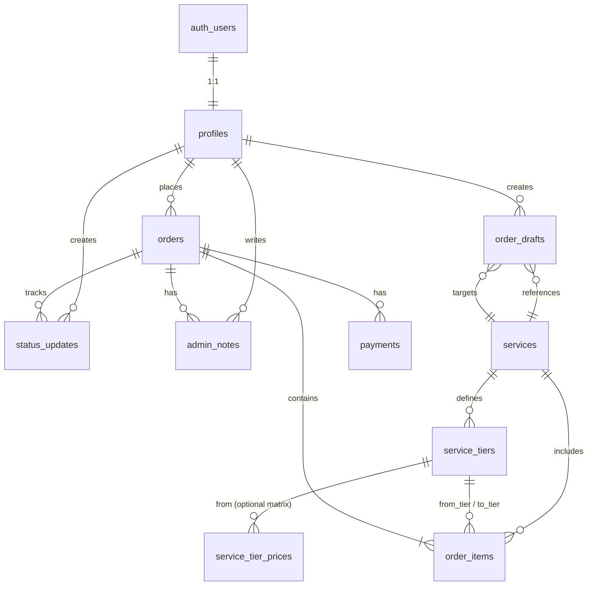
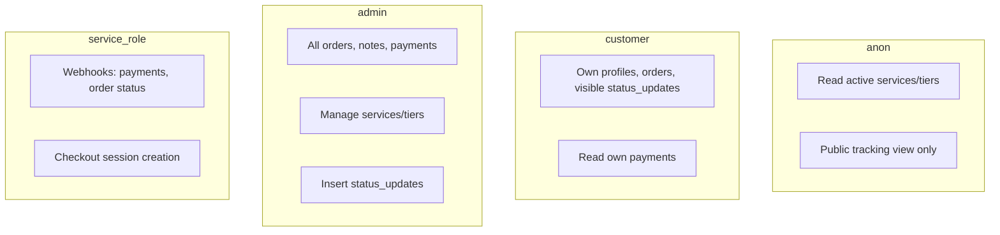

# WGG Apex — Database Schema Design

**Platform:** Supabase (PostgreSQL 15+)  
**Schema:** `public` (+ Supabase `auth` for identity)  
**Version:** 1.0  
**Status:** Design only — no migration files  
**Last updated:** 2026-06-04

---

## 1. Design principles

| Principle | Implementation |
|-----------|----------------|
| **Supabase Auth as source of truth** | `auth.users` for credentials; `public.profiles` for app identity & RBAC |
| **Money as integers** | All amounts in `*_cents` (`bigint` where totals may grow) |
| **UTC timestamps** | `timestamptz` everywhere; display in app layer |
| **Immutable snapshots** | Order line `configuration` JSONB frozen at purchase |
| **Append-only history** | `status_updates` never updated, only inserted |
| **RLS by default** | Every `public` table has RLS enabled; service role for webhooks/cron |
| **Idempotent payments** | Unique constraints on Stripe IDs + `stripe_event_id` |

---

## 2. Entity relationship diagram



---

## 3. Custom types (enums)

```sql
-- Application roles (stored on profiles, not on auth.users)
CREATE TYPE public.user_role AS ENUM (
  'customer',
  'booster',
  'admin',
  'super_admin'
);

-- Order lifecycle (current state on orders.status)
CREATE TYPE public.order_status AS ENUM (
  'draft',
  'pending_payment',
  'paid',
  'in_queue',
  'in_progress',
  'paused',
  'completed',
  'closed',
  'cancelled',
  'refund_requested',
  'refunded',
  'partially_refunded'
);

CREATE TYPE public.order_priority AS ENUM (
  'standard',
  'express'
);

CREATE TYPE public.platform_type AS ENUM (
  'pc',
  'playstation',
  'xbox',
  'switch'
);

CREATE TYPE public.payment_status AS ENUM (
  'pending',
  'processing',
  'succeeded',
  'failed',
  'cancelled',
  'refunded',
  'partially_refunded'
);

CREATE TYPE public.service_pricing_model AS ENUM (
  'tier_matrix',    -- rank boost: from_tier → to_tier
  'per_unit',       -- wins, RP bands, levels
  'flat'            -- badges, fixed packages
);
```

---

## 4. Table structures

### 4.1 `profiles` (Users)

Extends Supabase `auth.users`. One row per authenticated user.

| Column | Type | Constraints | Description |
|--------|------|-------------|-------------|
| `id` | `uuid` | PK, FK → `auth.users(id)` ON DELETE CASCADE | Same UUID as auth user |
| `email` | `text` | NOT NULL | Denormalized from auth for queries |
| `full_name` | `text` | | Display name |
| `avatar_url` | `text` | | |
| `role` | `user_role` | NOT NULL, DEFAULT `'customer'` | RBAC |
| `stripe_customer_id` | `text` | UNIQUE, nullable | Stripe Customer ID |
| `discord_handle` | `text` | nullable | Optional contact |
| `is_active` | `boolean` | NOT NULL, DEFAULT `true` | Soft disable login-facing features |
| `metadata` | `jsonb` | NOT NULL, DEFAULT `'{}'` | Extensibility |
| `created_at` | `timestamptz` | NOT NULL, DEFAULT `now()` | |
| `updated_at` | `timestamptz` | NOT NULL, DEFAULT `now()` | |

**Indexes**

- `profiles_email_idx` ON `(email)`
- `profiles_role_idx` ON `(role)` WHERE `is_active = true`
- `profiles_stripe_customer_id_idx` ON `(stripe_customer_id)` WHERE `stripe_customer_id IS NOT NULL`

**Triggers (planned)**

- `updated_at` auto-set on UPDATE
- On `auth.users` INSERT → create matching `profiles` row (Supabase trigger or app hook)

---

### 4.2 `services`

Catalog of boost types (rank, RP, wins, etc.).

| Column | Type | Constraints | Description |
|--------|------|-------------|-------------|
| `id` | `uuid` | PK, DEFAULT `gen_random_uuid()` | |
| `slug` | `text` | NOT NULL, UNIQUE | e.g. `rank-boost` |
| `name` | `text` | NOT NULL | Display name |
| `description` | `text` | | Marketing / admin |
| `short_description` | `text` | nullable | Card subtitle |
| `pricing_model` | `service_pricing_model` | NOT NULL | How quotes are computed |
| `is_active` | `boolean` | NOT NULL, DEFAULT `true` | Hide from catalog when false |
| `sort_order` | `integer` | NOT NULL, DEFAULT `0` | Catalog ordering |
| `form_schema` | `jsonb` | NOT NULL, DEFAULT `'{}'` | Dynamic form field definitions |
| `metadata` | `jsonb` | NOT NULL, DEFAULT `'{}'` | SEO, icons, ETA copy |
| `created_at` | `timestamptz` | NOT NULL, DEFAULT `now()` | |
| `updated_at` | `timestamptz` | NOT NULL, DEFAULT `now()` | |

**Indexes**

- `services_active_sort_idx` ON `(is_active, sort_order)` WHERE `is_active = true`
- `services_slug_idx` ON `(slug)` — redundant with UNIQUE but useful for partial lookups

---

### 4.3 `service_tiers`

Discrete tiers within a service — e.g. ranked divisions (Bronze IV → Predator) or RP bands.

| Column | Type | Constraints | Description |
|--------|------|-------------|-------------|
| `id` | `uuid` | PK, DEFAULT `gen_random_uuid()` | |
| `service_id` | `uuid` | NOT NULL, FK → `services(id)` ON DELETE RESTRICT | Parent service |
| `code` | `text` | NOT NULL | Machine key: `bronze_4`, `predator` |
| `name` | `text` | NOT NULL | Display: `Bronze IV` |
| `tier_group` | `text` | nullable | Rank family: `Bronze`, `Diamond` |
| `division` | `smallint` | nullable | 4–1 within group (rank boost) |
| `sort_order` | `integer` | NOT NULL | Monotonic ordering for quote math |
| `rp_min` | `integer` | nullable | For RP-band tiers |
| `rp_max` | `integer` | nullable | For RP-band tiers |
| `unit_price_cents` | `bigint` | nullable | Per-unit base (wins/levels) |
| `is_active` | `boolean` | NOT NULL, DEFAULT `true` | |
| `metadata` | `jsonb` | NOT NULL, DEFAULT `'{}'` | Icons, color, Predator flag |
| `created_at` | `timestamptz` | NOT NULL, DEFAULT `now()` | |
| `updated_at` | `timestamptz` | NOT NULL, DEFAULT `now()` | |

**Constraints**

- `UNIQUE (service_id, code)`
- `UNIQUE (service_id, sort_order)` — prevents ambiguous ordering
- `CHECK (sort_order >= 0)`
- Optional: `CHECK (rp_min IS NULL OR rp_max IS NULL OR rp_min <= rp_max)`

**Indexes**

- `service_tiers_service_sort_idx` ON `(service_id, sort_order)` WHERE `is_active = true`
- `service_tiers_service_code_idx` ON `(service_id, code)`

**Usage by pricing model**

| `pricing_model` | How tiers are used |
|-----------------|-------------------|
| `tier_matrix` | `from_tier` / `to_tier` on order; price from matrix or step sum |
| `per_unit` | Tier may define RP band or level bracket with `unit_price_cents` |
| `flat` | Single tier row = purchasable package (badge boost) |

---

### 4.4 `service_tier_prices` (pricing matrix — scalability)

Optional but recommended for **rank boost** and other from→to pricing. Avoids giant JSONB blobs on `services`.

| Column | Type | Constraints | Description |
|--------|------|-------------|-------------|
| `id` | `uuid` | PK, DEFAULT `gen_random_uuid()` | |
| `service_id` | `uuid` | NOT NULL, FK → `services(id)` ON DELETE CASCADE | Denormalized for filtering |
| `from_tier_id` | `uuid` | NOT NULL, FK → `service_tiers(id)` ON DELETE CASCADE | |
| `to_tier_id` | `uuid` | NOT NULL, FK → `service_tiers(id)` ON DELETE CASCADE | |
| `price_cents` | `bigint` | NOT NULL, CHECK (`price_cents` >= 0) | Fixed price for this pair |
| `currency` | `char(3)` | NOT NULL, DEFAULT `'USD'` | |
| `valid_from` | `timestamptz` | nullable | Scheduled price changes |
| `valid_to` | `timestamptz` | nullable | |
| `created_at` | `timestamptz` | NOT NULL, DEFAULT `now()` | |

**Constraints**

- `UNIQUE (from_tier_id, to_tier_id, currency)` — one active quote path per pair
- `CHECK (from_tier_id <> to_tier_id)` — or allow same for flat upgrades with app logic
- `CHECK (valid_to IS NULL OR valid_from IS NULL OR valid_from < valid_to)`
- Trigger or app check: `from_tier.sort_order < to_tier.sort_order` for rank boosts

**Indexes**

- `service_tier_prices_service_idx` ON `(service_id)`
- `service_tier_prices_from_to_idx` ON `(from_tier_id, to_tier_id)`

**Alternative (MVP simplification):** Compute rank price by summing per-step costs between adjacent tiers using only `service_tiers` + `unit_price_cents` on step rows. Matrix table can be added when pricing ops need overrides.

---

### 4.5 `order_drafts`

Pre-payment configuration and server-validated quote. Not required in your entity list but specified in product flow — included for checkout integrity.

| Column | Type | Constraints | Description |
|--------|------|-------------|-------------|
| `id` | `uuid` | PK, DEFAULT `gen_random_uuid()` | |
| `user_id` | `uuid` | FK → `profiles(id)` ON DELETE SET NULL, nullable | Null for guest session |
| `guest_session_id` | `text` | nullable | Cookie/session fingerprint pre-auth |
| `service_id` | `uuid` | NOT NULL, FK → `services(id)` ON DELETE RESTRICT | |
| `form_payload` | `jsonb` | NOT NULL, DEFAULT `'{}'` | Validated form state |
| `from_tier_id` | `uuid` | FK → `service_tiers(id)`, nullable | |
| `to_tier_id` | `uuid` | FK → `service_tiers(id)`, nullable | |
| `quoted_subtotal_cents` | `bigint` | NOT NULL, DEFAULT `0` | |
| `quoted_discount_cents` | `bigint` | NOT NULL, DEFAULT `0` | |
| `quoted_total_cents` | `bigint` | NOT NULL, DEFAULT `0` | |
| `currency` | `char(3)` | NOT NULL, DEFAULT `'USD'` | |
| `expires_at` | `timestamptz` | NOT NULL | TTL for abandoned drafts |
| `converted_order_id` | `uuid` | FK → `orders(id)`, nullable | Set when draft becomes order |
| `created_at` | `timestamptz` | NOT NULL, DEFAULT `now()` | |
| `updated_at` | `timestamptz` | NOT NULL, DEFAULT `now()` | |

**Indexes**

- `order_drafts_user_idx` ON `(user_id)` WHERE `converted_order_id IS NULL`
- `order_drafts_guest_session_idx` ON `(guest_session_id)` WHERE `user_id IS NULL`
- `order_drafts_expires_at_idx` ON `(expires_at)` — cleanup job

---

### 4.6 `orders`

Primary commerce aggregate. Current status denormalized for queue performance.

| Column | Type | Constraints | Description |
|--------|------|-------------|-------------|
| `id` | `uuid` | PK, DEFAULT `gen_random_uuid()` | |
| `order_number` | `text` | NOT NULL, UNIQUE | `WGG-2026-00001` |
| `user_id` | `uuid` | NOT NULL, FK → `profiles(id)` ON DELETE RESTRICT | Owner |
| `status` | `order_status` | NOT NULL, DEFAULT `'pending_payment'` | Current state |
| `service_id` | `uuid` | NOT NULL, FK → `services(id)` ON DELETE RESTRICT | Primary service |
| `order_draft_id` | `uuid` | FK → `order_drafts(id)`, nullable | Lineage |
| `subtotal_cents` | `bigint` | NOT NULL, DEFAULT `0` | |
| `discount_cents` | `bigint` | NOT NULL, DEFAULT `0` | |
| `total_cents` | `bigint` | NOT NULL, DEFAULT `0`, CHECK (`total_cents` >= 0) | |
| `currency` | `char(3)` | NOT NULL, DEFAULT `'USD'` | |
| `priority` | `order_priority` | NOT NULL, DEFAULT `'standard'` | |
| `platform` | `platform_type` | NOT NULL | |
| `region` | `text` | NOT NULL | e.g. `NA`, `EU` |
| `is_duo` | `boolean` | NOT NULL, DEFAULT `false` | Duo / piloted |
| `customer_notes` | `text` | nullable | Customer-visible safe notes |
| `internal_flags` | `jsonb` | NOT NULL, DEFAULT `'{}'` | Fraud, VIP, manual review |
| `public_tracking_token` | `text` | UNIQUE, nullable | Shareable tracking URL |
| `assigned_booster_id` | `uuid` | FK → `profiles(id)`, nullable | Phase 1.5 |
| `estimated_completion_at` | `timestamptz` | nullable | Ops ETA |
| `paid_at` | `timestamptz` | nullable | |
| `started_at` | `timestamptz` | nullable | First `in_progress` |
| `completed_at` | `timestamptz` | nullable | |
| `closed_at` | `timestamptz` | nullable | |
| `created_at` | `timestamptz` | NOT NULL, DEFAULT `now()` | |
| `updated_at` | `timestamptz` | NOT NULL, DEFAULT `now()` | |

**Indexes (critical for admin queue)**

- `orders_status_created_at_idx` ON `(status, created_at DESC)`
- `orders_user_created_at_idx` ON `(user_id, created_at DESC)`
- `orders_paid_queue_idx` ON `(created_at)` WHERE `status IN ('paid', 'in_queue')`
- `orders_order_number_idx` ON `(order_number)`
- `orders_tracking_token_idx` ON `(public_tracking_token)` WHERE `public_tracking_token IS NOT NULL`
- `orders_assigned_booster_idx` ON `(assigned_booster_id)` WHERE `assigned_booster_id IS NOT NULL`

**Sequence for `order_number`**

Use a dedicated `order_number_seq` + trigger or app-level function `generate_order_number()` to avoid race conditions.

---

### 4.7 `order_items`

Line-level snapshot (supports multi-service orders later; MVP typically one row).

| Column | Type | Constraints | Description |
|--------|------|-------------|-------------|
| `id` | `uuid` | PK, DEFAULT `gen_random_uuid()` | |
| `order_id` | `uuid` | NOT NULL, FK → `orders(id)` ON DELETE CASCADE | |
| `service_id` | `uuid` | NOT NULL, FK → `services(id)` ON DELETE RESTRICT | |
| `service_name` | `text` | NOT NULL | Snapshot |
| `from_tier_id` | `uuid` | FK → `service_tiers(id)`, nullable | |
| `to_tier_id` | `uuid` | FK → `service_tiers(id)`, nullable | |
| `from_tier_name` | `text` | nullable | Snapshot |
| `to_tier_name` | `text` | nullable | Snapshot |
| `quantity` | `integer` | NOT NULL, DEFAULT `1`, CHECK (`quantity` > 0) | Wins, levels, etc. |
| `unit_price_cents` | `bigint` | NOT NULL | Snapshot |
| `line_total_cents` | `bigint` | NOT NULL | |
| `configuration` | `jsonb` | NOT NULL, DEFAULT `'{}'` | Full form payload at purchase |
| `created_at` | `timestamptz` | NOT NULL, DEFAULT `now()` | |

**Indexes**

- `order_items_order_id_idx` ON `(order_id)`

---

### 4.8 `payments`

Stripe payment records. Multiple rows per order allowed (retries, partial refunds).

| Column | Type | Constraints | Description |
|--------|------|-------------|-------------|
| `id` | `uuid` | PK, DEFAULT `gen_random_uuid()` | |
| `order_id` | `uuid` | NOT NULL, FK → `orders(id)` ON DELETE RESTRICT | |
| `user_id` | `uuid` | NOT NULL, FK → `profiles(id)` ON DELETE RESTRICT | Payer |
| `amount_cents` | `bigint` | NOT NULL, CHECK (`amount_cents` >= 0) | |
| `currency` | `char(3)` | NOT NULL, DEFAULT `'USD'` | |
| `status` | `payment_status` | NOT NULL, DEFAULT `'pending'` | |
| `stripe_checkout_session_id` | `text` | UNIQUE, nullable | |
| `stripe_payment_intent_id` | `text` | UNIQUE, nullable | |
| `stripe_charge_id` | `text` | UNIQUE, nullable | |
| `stripe_refund_id` | `text` | UNIQUE, nullable | |
| `stripe_event_id` | `text` | UNIQUE, nullable | Webhook idempotency |
| `failure_code` | `text` | nullable | |
| `failure_message` | `text` | nullable | |
| `metadata` | `jsonb` | NOT NULL, DEFAULT `'{}'` | Raw Stripe snippet (no PAN) |
| `paid_at` | `timestamptz` | nullable | |
| `refunded_at` | `timestamptz` | nullable | |
| `created_at` | `timestamptz` | NOT NULL, DEFAULT `now()` | |
| `updated_at` | `timestamptz` | NOT NULL, DEFAULT `now()` | |

**Indexes**

- `payments_order_id_idx` ON `(order_id)`
- `payments_status_idx` ON `(status, created_at DESC)`
- `payments_stripe_checkout_session_id_idx` ON `(stripe_checkout_session_id)`
- `payments_stripe_payment_intent_id_idx` ON `(stripe_payment_intent_id)`

---

### 4.9 `status_updates`

Append-only order timeline (customer-visible and system events).

| Column | Type | Constraints | Description |
|--------|------|-------------|-------------|
| `id` | `uuid` | PK, DEFAULT `gen_random_uuid()` | |
| `order_id` | `uuid` | NOT NULL, FK → `orders(id)` ON DELETE CASCADE | |
| `from_status` | `order_status` | nullable | Null for initial creation event |
| `to_status` | `order_status` | NOT NULL | |
| `message` | `text` | nullable | Shown on tracking timeline |
| `is_customer_visible` | `boolean` | NOT NULL, DEFAULT `true` | Hide internal transitions |
| `created_by` | `uuid` | FK → `profiles(id)` ON DELETE SET NULL, nullable | Null = system |
| `metadata` | `jsonb` | NOT NULL, DEFAULT `'{}'` | IP, user agent, % progress |
| `created_at` | `timestamptz` | NOT NULL, DEFAULT `now()` | |

**Indexes**

- `status_updates_order_created_idx` ON `(order_id, created_at ASC)`
- `status_updates_customer_visible_idx` ON `(order_id, created_at)` WHERE `is_customer_visible = true`

**Triggers (planned)**

- ON INSERT → sync `orders.status` = `NEW.to_status` and set `paid_at` / `completed_at` timestamps when applicable

---

### 4.10 `admin_notes`

Internal-only ops notes. Never exposed to customer RLS policies.

| Column | Type | Constraints | Description |
|--------|------|-------------|-------------|
| `id` | `uuid` | PK, DEFAULT `gen_random_uuid()` | |
| `order_id` | `uuid` | NOT NULL, FK → `orders(id)` ON DELETE CASCADE | |
| `author_id` | `uuid` | NOT NULL, FK → `profiles(id)` ON DELETE RESTRICT | |
| `body` | `text` | NOT NULL | |
| `is_pinned` | `boolean` | NOT NULL, DEFAULT `false` | Pin to top in admin UI |
| `created_at` | `timestamptz` | NOT NULL, DEFAULT `now()` | |
| `updated_at` | `timestamptz` | NOT NULL, DEFAULT `now()` | |

**Indexes**

- `admin_notes_order_created_idx` ON `(order_id, created_at DESC)`
- `admin_notes_author_idx` ON `(author_id)`

---

## 5. Relationship summary

| Parent | Child | Cardinality | ON DELETE |
|--------|-------|-------------|-----------|
| `auth.users` | `profiles` | 1:1 | CASCADE |
| `profiles` | `orders` | 1:N | RESTRICT |
| `profiles` | `order_drafts` | 1:N | SET NULL |
| `profiles` | `payments` | 1:N | RESTRICT |
| `profiles` | `status_updates` | 1:N (author) | SET NULL |
| `profiles` | `admin_notes` | 1:N (author) | RESTRICT |
| `services` | `service_tiers` | 1:N | RESTRICT |
| `services` | `service_tier_prices` | 1:N | CASCADE |
| `services` | `orders` | 1:N | RESTRICT |
| `service_tiers` | `service_tier_prices` | N:M (via from/to FKs) | CASCADE |
| `service_tiers` | `order_items` | 0:2 (from/to) | — |
| `orders` | `order_items` | 1:N | CASCADE |
| `orders` | `payments` | 1:N | RESTRICT |
| `orders` | `status_updates` | 1:N | CASCADE |
| `orders` | `admin_notes` | 1:N | CASCADE |
| `order_drafts` | `orders` | 1:1 (optional) | — |

---

## 6. Helper functions (planned, not migrations)

These support RLS and application queries:

```sql
-- Returns true if current user has admin or super_admin role
public.is_admin() → boolean

-- Returns true if current user is super_admin
public.is_super_admin() → boolean

-- Returns true if current user owns the order or is assigned booster
public.can_access_order(order_id uuid) → boolean

-- Returns role of auth.uid() from profiles
public.current_user_role() → user_role
```

Implement as `SECURITY DEFINER` with fixed `search_path = public` and minimal logic to avoid RLS recursion.

---

## 7. Row Level Security (RLS) recommendations

**Global rules**

1. `ALTER TABLE ... ENABLE ROW LEVEL SECURITY` on every `public` table.
2. Default deny: no policy = no access for `authenticated` / `anon`.
3. **Stripe webhooks & admin bulk jobs** use Supabase **service role** (bypasses RLS) only in secure server environments — never expose service key to the browser.
4. Prefer `auth.uid()` in policies; join `profiles` for role checks via `is_admin()`.

### 7.1 `profiles`

| Policy | Role | Operation | Rule |
|--------|------|-----------|------|
| Users read own profile | `authenticated` | SELECT | `id = auth.uid()` |
| Users update own profile | `authenticated` | UPDATE | `id = auth.uid()` — column-limited: `full_name`, `avatar_url`, `discord_handle`, `metadata` (not `role`) |
| Admins read all profiles | `authenticated` | SELECT | `is_admin()` |
| Super admins update roles | `authenticated` | UPDATE | `is_super_admin()` |

**No** INSERT/DELETE for clients — profile created by auth trigger. Service role manages deletes.

### 7.2 `services` & `service_tiers` & `service_tier_prices`

| Policy | Role | Operation | Rule |
|--------|------|-----------|------|
| Public read active catalog | `anon`, `authenticated` | SELECT | `is_active = true` (services & tiers) |
| Admin manage catalog | `authenticated` | ALL | `is_admin()` |

Pricing matrix: public read optional — **recommended:** expose prices only via API/Edge Function; if direct read, limit to `SELECT` on active rows only.

### 7.3 `order_drafts`

| Policy | Role | Operation | Rule |
|--------|------|-----------|------|
| Owner access | `authenticated` | ALL | `user_id = auth.uid()` |
| Guest draft (optional) | `anon` | INSERT, SELECT, UPDATE | `user_id IS NULL AND guest_session_id = current_setting('app.guest_session_id', true)` — requires middleware to set session GUC or use Edge Function only |

**Recommendation:** Handle drafts via **Next.js server actions + service role** for MVP instead of anon RLS — simpler and safer.

### 7.4 `orders`

| Policy | Role | Operation | Rule |
|--------|------|-----------|------|
| Customer read own | `authenticated` | SELECT | `user_id = auth.uid()` |
| Customer insert own | `authenticated` | INSERT | `user_id = auth.uid()` |
| Customer update limited | `authenticated` | UPDATE | `user_id = auth.uid() AND status IN ('draft', 'pending_payment')` — only safe fields via view |
| Booster read assigned | `authenticated` | SELECT | `assigned_booster_id = auth.uid()` |
| Admin full ops | `authenticated` | ALL | `is_admin()` |

**No** customer DELETE.

### 7.5 `order_items`

| Policy | Role | Operation | Rule |
|--------|------|-----------|------|
| Inherit order access | `authenticated` | SELECT | EXISTS order where `can_access_order(order_id)` |
| Admin insert/update | `authenticated` | INSERT | `is_admin()` — normally created server-side at checkout |

### 7.6 `payments`

| Policy | Role | Operation | Rule |
|--------|------|-----------|------|
| Customer read own | `authenticated` | SELECT | `user_id = auth.uid()` |
| Admin read all | `authenticated` | SELECT | `is_admin()` |
| Writes | — | INSERT/UPDATE | **Service role only** (webhooks) |

Customers should never insert or update payment rows directly.

### 7.7 `status_updates`

| Policy | Role | Operation | Rule |
|--------|------|-----------|------|
| Customer read visible | `authenticated` | SELECT | `EXISTS (SELECT 1 FROM orders o WHERE o.id = order_id AND o.user_id = auth.uid()) AND is_customer_visible = true` |
| Booster read assigned | `authenticated` | SELECT | via `can_access_order(order_id)` |
| Admin read all | `authenticated` | SELECT | `is_admin()` |
| Admin insert | `authenticated` | INSERT | `is_admin()` AND `created_by = auth.uid()` |
| Public tracking | `anon` | SELECT | Separate **view** `order_tracking_public` exposing only `to_status`, `message`, `created_at` where order matches `public_tracking_token` — do not expose table directly |

### 7.8 `admin_notes`

| Policy | Role | Operation | Rule |
|--------|------|-----------|------|
| Admin only | `authenticated` | ALL | `is_admin()` |

Customers and boosters: **no policy** (denied by default).

### 7.9 RLS diagram



---

## 8. Security & sensitive data

| Data | Storage guidance |
|------|------------------|
| Account credentials | **Do not** store plaintext in `customer_notes`. Phase 1.5: `order_credentials` table with pgcrypto / Vault |
| Stripe secrets | Never in database |
| `public_tracking_token` | High-entropy (`gen_random_bytes(32)` hex); rotate on request |
| PII in `metadata` | Minimize; GDPR delete cascades from `auth.users` |

**Column-level encryption (future):** `order_credentials.encrypted_payload` + app-managed key in Supabase Vault.

---

## 9. Future scalability considerations

### 9.1 Partitioning & archival

| Table | Strategy |
|-------|----------|
| `status_updates` | Range partition by `created_at` (monthly) when &gt; 10M rows |
| `payments` | Partition by `created_at`; archive refunded &gt; 2 years to cold storage |
| `orders` | Partial indexes per `status`; archive `closed` orders &gt; 18 months to `orders_archive` |

### 9.2 Read replicas & caching

- Route admin reporting to read replica.
- Cache active `services` + `service_tiers` in Redis/Edge Config (invalidate on admin update).

### 9.3 Multi-tenancy & multi-game

Reserve optional `game_id` on `services` (default Apex). `metadata.game = 'apex'` until expansion.

```sql
-- Future column
-- game_id uuid REFERENCES games(id)
```

### 9.4 Internationalization & pricing

- `currency` already on monetary tables.
- Add `service_tier_prices.region` or separate `pricing_regions` table.
- Never mix currencies on a single `order`.

### 9.5 Coupons & affiliates (Phase 1.5+)

```text
coupons ──< coupon_redemptions >── orders
affiliates ──< referral_attributions >── orders
```

Keep redemptions as separate rows to preserve order snapshot totals.

### 9.6 Booster marketplace

- `assigned_booster_id` already on `orders`.
- Add `booster_profiles` (stats, availability), `order_assignments` history, `completion_proofs` (S3 path).

### 9.7 Audit & compliance

```text
audit_logs (actor_id, action, entity_type, entity_id, metadata, created_at)
```

Append-only; no RLS for customers; admin read-only; ingest via service role.

### 9.8 Realtime

Supabase Realtime on `orders` (status) and `status_updates` for customer tracking page — filter subscriptions by `order_id` and RLS.

### 9.9 Full-text search

`orders_search` materialized view or `tsvector` on `order_number`, `customer_notes`, profile email for admin search — `GIN` index.

### 9.10 Connection pooling

Use Supabase pooler (transaction mode) for serverless Next.js; session mode only when using temp tables or advisory locks.

### 9.11 Schema versioning

- Migrations via Supabase CLI / `supabase/migrations`.
- Seed `services` + `service_tiers` in `supabase/seed.sql`.
- Feature flags in `app_settings` key-value table (future).

---

## 10. Suggested views (application layer)

| View | Purpose |
|------|---------|
| `order_tracking_public` | Safe columns for `/track/[token]` |
| `admin_order_queue` | Joins order + user email + latest status + payment status |
| `customer_order_summary` | Orders + last visible status message |

Views inherit RLS from underlying tables when `security_invoker = true` (Postgres 15+).

---

## 11. Seed data outline (reference)

**Services (MVP)**

| slug | pricing_model |
|------|---------------|
| `rank-boost` | `tier_matrix` |
| `rp-boost` | `per_unit` |
| `win-boost` | `per_unit` |
| `level-boost` | `per_unit` |
| `badge-boost` | `flat` |

**Rank tiers:** ~24–28 rows under `rank-boost` (Bronze IV through Predator, `sort_order` monotonic).

---

## 12. Entity checklist (requested)

| Entity | Table(s) |
|--------|----------|
| Users | `profiles` (+ `auth.users`) |
| Orders | `orders`, `order_items`, `order_drafts` |
| Services | `services` |
| Service Tiers | `service_tiers`, `service_tier_prices` |
| Payments | `payments` |
| Status Updates | `status_updates` |
| Admin Notes | `admin_notes` |

---

## 13. Next steps (when implementing)

1. Create enums and tables in dependency order (see migration order below).
2. Add helper functions → enable RLS → apply policies.
3. Auth trigger: `on_auth_user_created` → insert `profiles`.
4. Status sync trigger on `status_updates`.
5. Seed services + tiers + sample matrix.
6. Generate TypeScript types (`supabase gen types`).

**Migration order (reference only)**

```text
1. enums
2. profiles
3. services
4. service_tiers
5. service_tier_prices
6. order_drafts
7. orders
8. order_items
9. payments
10. status_updates
11. admin_notes
12. functions → triggers → RLS policies → views
```

---

*End of database schema design. No migration files included per project directive.*
