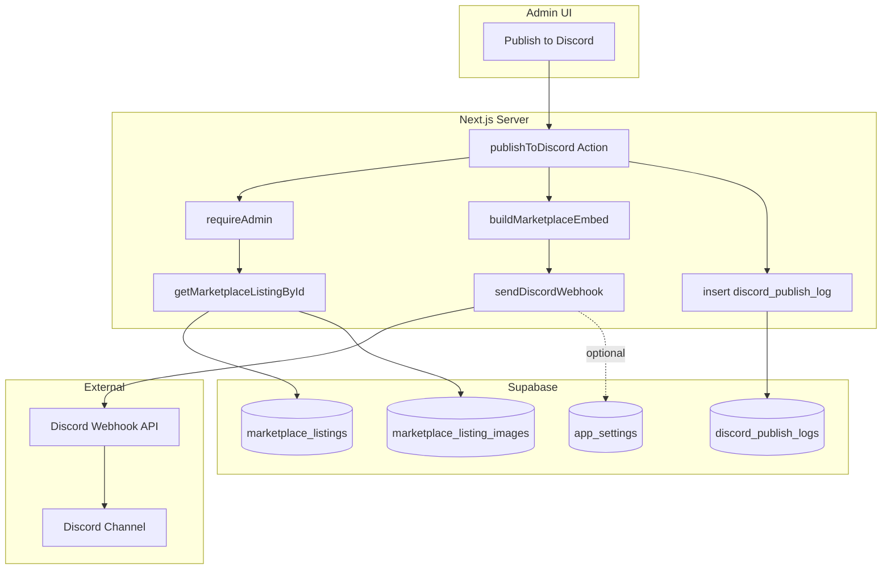
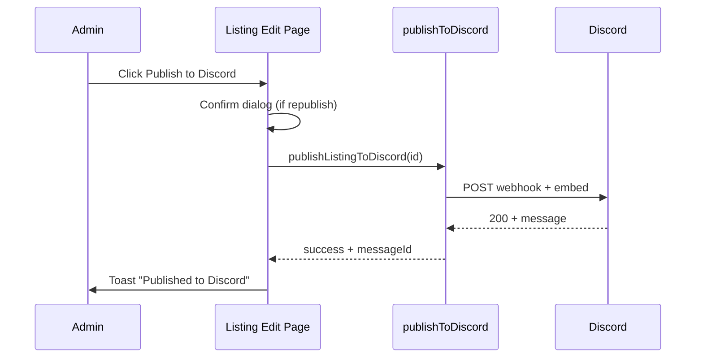

# WGG Apex — Discord Publishing System

**Version:** 1.0  
**Status:** Architecture & implementation plan only — no code  
**Last updated:** 2026-06-04  
**Aligned with:** `marketplace_listings`, `SERVICES_ARCHITECTURE.md`, admin marketplace CMS

---

## 1. Executive summary

When an admin publishes an account listing to Discord, the system builds a **rich embed** from live listing data (image, description, price, rank, platform, status) and posts it to a configured **Discord webhook**. The flow is one-click from the listing editor, fully server-side, with audit logging and safe retries.

**In scope (MVP)**

- Manual **Publish to Discord** from admin listing edit screen
- Single marketplace webhook URL (env or admin settings)
- Auto-generated embed + public listing URL
- Publish history per listing (success/failure, timestamp, actor)

**Out of scope (MVP)**

- Discord Bot API / slash commands
- Auto-publish on listing create
- Edit/delete Discord message when listing updates (Phase 2)
- Order/status notification webhooks (separate channel config)

---

## 2. Current platform context

| Asset | State |
|-------|--------|
| `marketplace_listings` + images | Implemented; Supabase Storage bucket `marketplace-listings` (public read) |
| Admin edit UI | `/admin/marketplace/[id]` with `ListingForm` |
| Public detail URL | `/marketplace/[id]` |
| `/admin/discord` | Placeholder only |
| Discord integration code | None |

**Implication:** Publishing can ship without new listing fields beyond optional Discord metadata columns. Image URLs are already public HTTPS endpoints suitable for Discord `embed.image.url`.

---

## 3. Requirements mapping

| Requirement | Design response |
|-------------|-----------------|
| Admin creates listing | Existing CMS; publish is post-create action |
| Admin clicks **Publish to Discord** | Server Action on listing edit page + optional bulk later |
| Generate Discord embed | `lib/discord/build-marketplace-embed.ts` pure function |
| Use listing image | First image by `sort_order`; fallback thumbnail or no image |
| Use description | Embed `description` (truncate to Discord limits) |
| Use price | Embed `field` + title suffix; format from `price_cents` |
| Send to webhook | `lib/discord/send-webhook.ts` server-only |

---

## 4. Architecture overview



### 4.1 Design principles

1. **Server-only secrets** — Webhook URL never exposed to browser  
2. **Idempotent-friendly** — Log every attempt; optional “already published” guard with override  
3. **Fail visibly** — Admin sees toast with Discord error message; log row `status = failed`  
4. **Public URLs only** — Embed links and images must be reachable by Discord (already true for storage)  
5. **Brand-consistent** — WGG colors in embed `color`; footer “WGG Apex · Account Marketplace”

---

## 5. Discord webhook integration

### 5.1 API choice: Incoming Webhook (MVP)

| Option | Pros | Cons | MVP |
|--------|------|------|-----|
| **Incoming Webhook** | Simple POST, no bot hosting | No thread control without webhook config; edit needs message ID | **Yes** |
| Discord Bot + channel API | Edit/delete messages, components | OAuth, bot token, gateway | Phase 2 |

**Endpoint**

```http
POST https://discord.com/api/v10/webhooks/{webhook_id}/{webhook_token}?wait=true
Content-Type: application/json
```

`?wait=true` returns the created [Message](https://discord.com/developers/docs/resources/channel#message-object) so we can store `discord_message_id` and `discord_channel_id` for future edits.

### 5.2 Rate limits & limits

| Limit | Value | Mitigation |
|-------|-------|------------|
| Webhook rate limit | ~30 requests / 60s per webhook | Server-side throttle; disable button 2s after click |
| Embed description | 4096 chars | Truncate with ellipsis |
| Embed field value | 1024 chars | Split long description into fields if needed |
| Embed title | 256 chars | Truncate listing title |
| Embeds per message | 10 max | Send 1 embed |
| Image URL | Public HTTPS | Supabase public bucket |

### 5.3 Webhook configuration (MVP)

**Option A (fastest):** Environment variable

```env
DISCORD_MARKETPLACE_WEBHOOK_URL=https://discord.com/api/webhooks/...
```

**Option B (recommended):** `app_settings` table + admin UI on `/admin/discord`

| Key | Value | Notes |
|-----|-------|-------|
| `discord.marketplace_webhook_url` | encrypted or plain server-only read | Rotatable in admin |
| `discord.marketplace_enabled` | `true` | Kill switch |

**Recommendation:** MVP ships with **env var**; Phase 1.5 migrates to `app_settings` UI already scaffolded at `/admin/discord`.

---

## 6. Embed specification

### 6.1 Visual structure

```
┌─────────────────────────────────────────────┐
│ [EMBED COLOR BAR - WGG orange]              │
│ Title: Master · 2 Heirlooms — $420.00       │
│ Description: (listing description excerpt)  │
│ ┌─────────────────────────────────────────┐ │
│ │         [embed.image - listing photo]    │ │
│ └─────────────────────────────────────────┘ │
│ Fields:                                     │
│   Rank      │ Master                        │
│   Platform  │ PC                            │
│   Heirlooms │ 2                             │
│   Status    │ Available                     │
│   RP        │ 18,400 RP (if set)            │
│ Footer: WGG Apex · ACC-2026-00042           │
│ Link: View listing → /marketplace/{id}      │
└─────────────────────────────────────────────┘
```

### 6.2 Embed JSON template (conceptual)

```json
{
  "username": "WGG Apex",
  "avatar_url": "https://{site}/images/wgg-brand-icon.png",
  "embeds": [
    {
      "title": "{title} — {priceFormatted}",
      "url": "{siteUrl}/marketplace/{listingId}",
      "description": "{truncatedDescription}",
      "color": 16744448,
      "fields": [
        { "name": "Rank", "value": "{rankLabel}", "inline": true },
        { "name": "Platform", "value": "{platformLabel}", "inline": true },
        { "name": "Heirlooms", "value": "{heirloomCount}", "inline": true },
        { "name": "Status", "value": "{statusLabel}", "inline": true }
      ],
      "image": { "url": "{primaryImagePublicUrl}" },
      "footer": {
        "text": "WGG Apex · {listingNumber}"
      },
      "timestamp": "{iso8601}"
    }
  ]
}
```

### 6.3 Status-specific copy (embed)

| DB status | Embed field value | Color tweak (optional) |
|-----------|-------------------|-------------------------|
| `available` | Available — Inquire to purchase | Orange `#F97316` (16744448) |
| `reserved` | Reserved | Amber tint optional |
| `sold` | Sold (social proof) | Muted gray optional |

**MVP:** Same orange brand color for all; status shown in field only. Phase 2: color by status.

### 6.4 Image selection rules

1. Query `marketplace_listing_images` ordered by `sort_order ASC`  
2. Use first image `publicUrl` as `embed.image.url`  
3. If no images: omit `image`; optionally set `thumbnail` to WGG logo URL  
4. Validate URL length & HTTPS before send  

**Note:** Discord caches embed images aggressively; changing image after publish requires a new message (Phase 2: edit message).

### 6.5 Description fallback

If `description` is null/empty:

```text
{rankLabel} account on {platform}. {heirloomCount} heirloom(s). Verified WGG Apex listing.
```

---

## 7. Database schema

### 7.1 `discord_publish_logs` (audit + optional message tracking)

| Column | Type | Notes |
|--------|------|-------|
| `id` | `uuid` PK | |
| `listing_id` | `uuid` FK → `marketplace_listings` | |
| `published_by` | `uuid` FK → `profiles` | Admin actor |
| `webhook_key` | `text` | e.g. `marketplace` — supports multiple webhooks later |
| `status` | `text` | `success`, `failed` |
| `discord_message_id` | `text` nullable | From `?wait=true` response |
| `discord_channel_id` | `text` nullable | For future edits |
| `request_payload` | `jsonb` | Embed JSON sent (redact webhook URL) |
| `response_payload` | `jsonb` nullable | Discord response or error |
| `error_message` | `text` nullable | Human-readable |
| `created_at` | `timestamptz` | |

**Indexes**

- `(listing_id, created_at DESC)`
- `(status, created_at DESC)` for admin Discord tools dashboard

**RLS**

- `SELECT` / `INSERT`: `is_admin()` only  
- No public access  

### 7.2 Optional columns on `marketplace_listings` (denormalized convenience)

| Column | Type | Purpose |
|--------|------|---------|
| `last_discord_published_at` | `timestamptz` nullable | Quick UI badge |
| `last_discord_message_id` | `text` nullable | Phase 2 edit/sync |

**Alternative:** Derive from latest `discord_publish_logs` row — avoids migration on listings table for MVP.

**Recommendation:** Use **logs only** for MVP; add listing columns in Phase 2 if query cost matters.

### 7.3 `app_settings` (Phase 1.5)

| key | value (jsonb) |
|-----|----------------|
| `discord.marketplace` | `{ "webhookUrl": "...", "enabled": true, "username": "WGG Apex" }` |

Webhook URL stored server-side; never returned to client in full (mask `***` in UI).

---

## 8. Server module layout

```text
src/lib/discord/
├── constants.ts           # Colors, limits, username
├── build-marketplace-embed.ts   # Pure: listing → Discord embed payload
├── send-webhook.ts        # POST to Discord; parse response / errors
├── validate-webhook-url.ts
└── types.ts               # DiscordEmbedPayload, PublishResult

src/actions/admin/discord/
├── publish-listing.ts     # publishListingToDiscord(listingId, options?)
└── test-webhook.ts        # send test embed from /admin/discord

src/lib/db/discord-publish-logs.ts
```

### 8.1 `buildMarketplaceEmbed(listing, siteUrl)`

**Input:** `MarketplaceListing` (from `getMarketplaceListingById`)  
**Output:** `{ username?, avatar_url?, embeds: [...] }` — ready for Discord API  

**Pure function** — unit testable without network.

### 8.2 `sendDiscordWebhook(payload, webhookUrl)`

- `fetch` with 10s timeout  
- Handle HTTP 204 (no body) vs 200 with message JSON when `wait=true`  
- Map Discord 4xx to friendly errors (401 invalid webhook, 404, 429 rate limit)  
- Never log full webhook URL in `request_payload` metadata  

### 8.3 `publishListingToDiscord` Server Action

```typescript
// Pseudocode
export async function publishListingToDiscord(
  listingId: string,
  options?: { force?: boolean }
): Promise<ActionResult<PublishResult>>
```

| Step | Action |
|------|--------|
| 1 | `requireAdmin()` |
| 2 | Load listing + images |
| 3 | Validate status ∈ `available`, `reserved`, `sold` (not `draft`) |
| 4 | Optional: block if last successful publish < 5 min unless `force` |
| 5 | Build embed |
| 6 | POST webhook |
| 7 | Insert `discord_publish_logs` |
| 8 | `revalidatePath` listing admin + `/admin/discord` |
| 9 | Return `{ messageId, channelId, logId }` |

---

## 9. Admin UX flow

### 9.1 Primary flow (listing edit page)

**Location:** `/admin/marketplace/[id]` — header action bar next to Save / Delete



**UI elements**

| Element | Behavior |
|---------|----------|
| **Publish to Discord** button | Primary outline; Discord icon |
| Disabled when | `draft` status, no webhook configured, request in flight |
| **Last published** chip | “Published 2h ago” from latest log |
| Confirm modal | If published in last 24h: “Publish again?” |

**Loading state:** Button spinner + disable form actions.

### 9.2 Discord Tools page (`/admin/discord`)

| Section | Purpose |
|---------|---------|
| Webhook status | Configured / missing (env or settings) |
| **Send test message** | Verifies webhook connectivity |
| Recent publish log | Table: listing #, admin, status, time, error |
| Docs link | How to create Discord webhook in server settings |

### 9.3 Error UX

| Error | Admin message |
|-------|----------------|
| Webhook not configured | Configure `DISCORD_MARKETPLACE_WEBHOOK_URL` in settings |
| Draft listing | Publish listing as Available first |
| Discord 404 | Webhook invalid or deleted — regenerate in Discord |
| Discord 429 | Rate limited — try again in a minute |
| Image URL invalid | Check listing images are uploaded |

Use **Sonner** toasts (already in admin layout).

---

## 10. Security

| Risk | Mitigation |
|------|------------|
| Webhook URL leak | Server-only env; never in `NEXT_PUBLIC_*` |
| Non-admin publish | `requireAdmin()` on action |
| SSRF via image URL | Only use URLs from our Supabase storage builder, not user-supplied arbitrary URLs |
| Log injection | Sanitize Discord response before storing |
| Spam | Per-admin rate limit (e.g. 10/min via Upstash or in-memory) |
| Replay | Audit log; optional cooldown |

**CSP / outbound:** Server Action runs on Node — `fetch` to `discord.com` allowed in hosting (Vercel default allows).

---

## 11. Environment variables

```env
# Required for marketplace publishing (MVP)
DISCORD_MARKETPLACE_WEBHOOK_URL=https://discord.com/api/webhooks/{id}/{token}

# Optional overrides
DISCORD_WEBHOOK_USERNAME=WGG Apex
DISCORD_WEBHOOK_AVATAR_URL=https://wggapex.com/images/discord-avatar.png
DISCORD_PUBLISH_COOLDOWN_SECONDS=300
```

`.env.example` updated at implementation time.

---

## 12. Interaction with listing lifecycle

| Listing event | Discord behavior (MVP) | Phase 2 |
|---------------|--------------------------|---------|
| Created draft | No auto-publish | — |
| Set to Available | Manual publish only | Optional auto-publish |
| Price/description edited | No sync | PATCH message if `message_id` stored |
| Set to Sold | No auto-update | Edit embed or reply thread |
| Deleted | No delete | Archive message |

---

## 13. Observability

| Signal | Implementation |
|--------|----------------|
| Success/fail logs | `discord_publish_logs` |
| Admin dashboard | `/admin/discord` recent activity |
| Server logs | Structured log `discord.publish` with `listingId`, `messageId` |
| Sentry (optional) | Capture Discord 5xx as warnings |

---

## 14. Testing strategy

| Layer | Tests |
|-------|-------|
| Unit | `buildMarketplaceEmbed` — truncation, fields, no image, sold status |
| Unit | `validateWebhookUrl` — reject non-Discord hosts |
| Integration | Mock `fetch` Discord API — success 200, 404, 429 |
| E2E (manual) | Test webhook in private channel; verify image renders |
| Staging | Separate `#marketplace-staging` webhook |

**Manual test checklist**

- [ ] Available listing with image → embed shows image + price  
- [ ] Listing without description → fallback text  
- [ ] Sold listing → status field shows Sold  
- [ ] Invalid webhook → admin sees clear error  
- [ ] Republish → second message appears (expected); log has 2 rows  

---

## 15. Implementation plan

### Phase 1 — Core publish (MVP) — ~1–2 days

| # | Task | Files / artifacts |
|---|------|-------------------|
| 1 | Migration `discord_publish_logs` + RLS | `supabase/migrations/..._discord_publish.sql` |
| 2 | Discord lib: types, constants, embed builder | `src/lib/discord/*` |
| 3 | Webhook sender | `send-webhook.ts` |
| 4 | Server Action `publishListingToDiscord` | `src/actions/admin/discord/publish-listing.ts` |
| 5 | DB helper insert log | `src/lib/db/discord-publish-logs.ts` |
| 6 | UI: Publish button + last published + toasts | `listing-form.tsx` or `listing-discord-publish.tsx` |
| 7 | Env vars + `.env.example` | |
| 8 | Manual test with real webhook | |

**Definition of done:** Admin publishes listing → message appears in Discord channel with image, description, price, rank, platform, status.

### Phase 2 — Discord Tools admin — ~1 day

| # | Task |
|---|------|
| 1 | Replace `/admin/discord` placeholder with webhook status + test button |
| 2 | Recent publish logs table |
| 3 | `testWebhook` Server Action (simple “WGG Apex webhook connected” embed) |

### Phase 3 — Settings & sync — ~2 days

| # | Task |
|---|------|
| 1 | `app_settings` storage for webhook URL (masked UI) |
| 2 | Store `discord_message_id` on successful publish |
| 3 | `updateDiscordMessage` when listing status → Sold (optional PATCH) |
| 4 | “Publish on save when Available” toggle (off by default) |

### Phase 4 — Multi-channel — future

- Separate webhooks: orders, support, marketplace-premium  
- Role pings via `allowed_mentions` (careful with spam)  
- Discord Bot for interactive buttons (“View listing” link component)

---

## 16. File change summary (implementation reference)

```text
NEW
  supabase/migrations/*_discord_publish_logs.sql
  src/lib/discord/build-marketplace-embed.ts
  src/lib/discord/send-webhook.ts
  src/lib/discord/types.ts
  src/lib/discord/constants.ts
  src/lib/db/discord-publish-logs.ts
  src/actions/admin/discord/publish-listing.ts
  src/actions/admin/discord/test-webhook.ts
  src/components/admin/marketplace/listing-discord-actions.tsx

MODIFY
  src/app/(admin)/admin/marketplace/[id]/page.tsx
  src/app/(admin)/admin/discord/page.tsx
  .env.example

OPTIONAL
  public/images/discord-avatar.png   # Webhook avatar
```

---

## 17. Open decisions

| # | Question | Recommendation |
|---|----------|----------------|
| 1 | Block republish or allow duplicates? | Allow with confirmation; each publish = new message + log row |
| 2 | Publish `draft` listings? | Block; require `available`+ |
| 3 | Webhook in env vs DB? | Env for MVP; DB for Phase 3 |
| 4 | Include RP field always? | Yes when `rp_label` set |
| 5 | @everyone ping on new listing? | Off by default; too spammy |

---

## 18. Example Discord payload (reference)

Built from listing:

- **Title:** `Master · 2 Heirlooms — $420.00`  
- **URL:** `https://wggapex.com/marketplace/{uuid}`  
- **Description:** First 350 chars of description  
- **Image:** `https://{project}.supabase.co/storage/v1/object/public/marketplace-listings/{path}`  
- **Fields:** Rank, Platform, Heirlooms, Status  
- **Footer:** `WGG Apex · ACC-2026-00042`  

---

## 19. Document cross-reference

| Topic | Document |
|-------|----------|
| Marketplace data | `SERVICES_ARCHITECTURE.md`, `DATABASE_SCHEMA.md` |
| Admin structure | `PROJECT_STRUCTURE.md` |
| This system | `DISCORD_PUBLISHING.md` |

---

*End of Discord publishing architecture. No implementation in this deliverable.*
