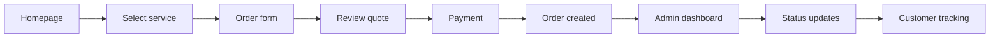
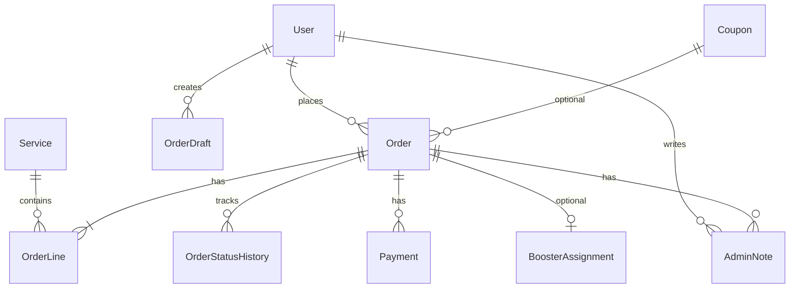
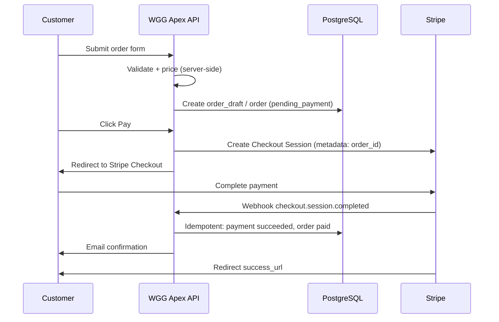
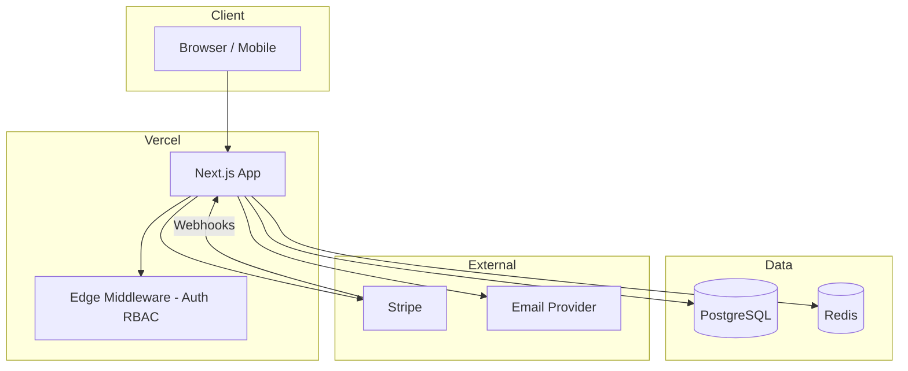

# WGG Apex — Project Specification

**Product:** Professional Apex Legends boosting platform  
**Version:** 1.0 (pre-development)  
**Status:** Specification only — no implementation yet  
**Last updated:** 2026-06-04

---

## 1. Executive Summary

WGG Apex is a premium, trust-first SaaS marketplace for Apex Legends boosting services. Customers browse services, configure orders, pay securely, and track progress in real time. Operators manage orders, boosters, payouts, and customer communication from a centralized admin dashboard.

**Design north star:** Dark, refined UI (Linear / Stripe / modern SaaS) with subtle gaming accents — not neon arcade clutter. Performance and mobile responsiveness are first-class.

**Primary goals**

| Goal | Success metric |
|------|----------------|
| Trust & conversion | Checkout completion rate, low payment disputes |
| Operational clarity | Admin can update any order in &lt; 30 seconds |
| Customer transparency | Status visible within 3 clicks from homepage |
| Performance | LCP &lt; 2.5s, TTI &lt; 3.5s on 4G mobile |

---

## 2. Product Scope

### 2.1 In scope (MVP)

- Marketing homepage + service catalog
- Multi-step order form with dynamic pricing
- Stripe checkout (card + optional wallets)
- Customer account: orders, tracking, receipts
- Admin dashboard: orders, status workflow, basic CRM notes
- Email notifications (order confirmation, status changes)
- Role-based access: Customer, Booster (optional MVP), Admin, Super Admin

### 2.2 Out of scope (MVP — future phases)

- Live chat / Discord bot integration
- Booster marketplace bidding
- Affiliate program
- Multi-game expansion
- Native mobile apps
- Crypto payments

### 2.3 Personas

| Persona | Needs |
|---------|--------|
| **Customer** | Fast quote, clear pricing, secure payment, progress tracking |
| **Admin / Ops** | Order queue, status updates, refund handling, fraud flags |
| **Booster** (Phase 1.5) | Assigned orders, completion proof upload |
| **Super Admin** | Pricing rules, service catalog, user management, analytics |

---

## 3. Sitemap

### 3.1 Public (marketing)

```
/
├── /services                    # Service catalog hub
│   ├── /services/rank-boost
│   ├── /services/rp-boost
│   ├── /services/win-boost
│   ├── /services/level-boost
│   ├── /services/badge-boost
│   └── /services/[slug]         # Dynamic service detail + CTA
├── /how-it-works
├── /pricing                     # Optional: comparison / FAQ anchor
├── /faq
├── /reviews                       # Social proof (curated testimonials)
├── /about
├── /contact
├── /legal
│   ├── /legal/terms
│   ├── /legal/privacy
│   └── /legal/refund-policy
└── /blog (Phase 2)
```

### 3.2 Customer (authenticated)

```
/app
├── /app/dashboard               # Order summary, active boosts
├── /app/orders
│   ├── /app/orders/new          # Redirect to service-specific form
│   └── /app/orders/[id]         # Order detail + timeline
├── /app/orders/[id]/track       # Public-safe tracking (token optional)
├── /app/account
│   ├── /app/account/profile
│   └── /app/account/security
└── /app/checkout
    ├── /app/checkout/[draftId]  # Review + pay
    └── /app/checkout/success
    └── /app/checkout/cancel
```

### 3.3 Admin (authenticated, RBAC)

```
/admin
├── /admin                       # KPI overview
├── /admin/orders
│   ├── /admin/orders            # List + filters
│   └── /admin/orders/[id]       # Detail, status, notes, assignment
├── /admin/customers
│   └── /admin/customers/[id]
├── /admin/services              # Catalog CRUD
├── /admin/pricing               # Rules, modifiers, coupons (Phase 1.5)
├── /admin/boosters              # Phase 1.5
├── /admin/payments              # Stripe events, refunds
├── /admin/settings
│   ├── /admin/settings/general
│   ├── /admin/settings/notifications
│   └── /admin/settings/integrations
└── /admin/audit-log
```

### 3.4 System / API (not in nav)

```
/api/auth/*
/api/orders/*
/api/checkout/*
/api/webhooks/stripe
/api/admin/*
/health
```

---

## 4. User Flows

### 4.1 Core business flow (happy path)



| Step | Actor | Action | System response |
|------|--------|--------|-----------------|
| 1 | Guest | Lands on homepage | SSR marketing page, trust signals, CTA to services |
| 2 | Guest | Selects boosting service | Navigate to service detail; show base pricing & ETA |
| 3 | Guest/Customer | Fills order form | Validate inputs; compute price server-side; save draft order |
| 4 | Customer | Completes payment | Stripe Checkout Session; webhook confirms payment |
| 5 | System | Creates paid order | Order `status = paid`; notify admin + customer email |
| 6 | Admin | Updates order status | Timeline event; optional customer notification |
| 7 | Customer | Tracks progress | Order detail shows timeline, current status, ETA |

### 4.2 Flow: Guest → first purchase

1. **Discover** — Homepage → `/services` or direct `/services/rank-boost`
2. **Configure** — Form collects: platform (PC/PS/Xbox), current rank, desired rank, region, priority, duo/solo, schedule notes
3. **Authenticate (soft gate)** — Email magic link or OAuth before checkout (recommended: account before payment to bind order)
4. **Review** — Summary page shows line items, total, estimated completion window
5. **Pay** — Redirect to Stripe Checkout
6. **Confirm** — Success page + email; order visible in `/app/dashboard`

**Edge cases**

- Abandoned draft → email reminder (Phase 1.5)
- Payment failed → return to checkout with draft preserved
- Duplicate payment webhook → idempotent order activation

### 4.3 Flow: Returning customer

1. Login → `/app/dashboard`
2. View active orders → `/app/orders/[id]`
3. Optional: reorder from past order (prefill form)

### 4.4 Flow: Admin order fulfillment

1. Login → `/admin/orders` (default sort: `paid`, oldest first)
2. Open order → verify customer inputs, platform, risk flags
3. Assign booster (Phase 1.5) or self-assign
4. Progress: `paid` → `in_queue` → `in_progress` → `paused` (optional) → `completed` → `closed`
5. On `completed`: trigger customer notification; prompt for review (Phase 1.5)

### 4.5 Flow: Customer tracking (transparency)

1. Customer opens `/app/orders/[id]`
2. Sees: status badge, progress stepper, timeline of admin updates, optional % or milestone text
3. Optional: shareable tracking link `/track/[publicToken]` (read-only, no PII beyond order ref)

### 4.6 Flow: Refund / dispute (ops)

1. Admin marks `refund_requested` or initiates Stripe refund from `/admin/payments`
2. Order → `refunded` or `partially_refunded`
3. Audit log entry required

---

## 5. Service Catalog (domain model)

### 5.1 Service types (MVP)

| Service | Key inputs | Pricing drivers |
|---------|------------|-----------------|
| Rank Boost | Current tier/division, target tier/division | Tier delta, Apex Predator premium |
| RP Boost | Current RP, target RP | RP bands |
| Win Boost | Win count, mode (BR/ Arenas) | Per-win × mode multiplier |
| Level Boost | Current level, target level | Level delta |
| Badge / Achievement | Badge selection | Fixed catalog price |

### 5.2 Order form fields (common)

- Platform, region, timezone preference
- Account credentials delivery method (secure vault — Phase 1.5; MVP: encrypted note or “contact on Discord”)
- Duo vs piloted
- Express / priority queue
- Customer notes
- Acknowledgment: account sharing terms, refund policy

---

## 6. Database Entities

**Recommended stack:** PostgreSQL + Prisma (or Drizzle). All monetary values in **integer cents**. All timestamps **UTC**.

### 6.1 Entity relationship overview



### 6.2 Tables / entities

#### `users`

| Column | Type | Notes |
|--------|------|-------|
| id | uuid PK | |
| email | varchar unique | |
| name | varchar nullable | |
| role | enum | `customer`, `booster`, `admin`, `super_admin` |
| avatar_url | varchar nullable | |
| stripe_customer_id | varchar nullable | |
| email_verified_at | timestamptz nullable | |
| created_at, updated_at | timestamptz | |

#### `services`

| Column | Type | Notes |
|--------|------|-------|
| id | uuid PK | |
| slug | varchar unique | e.g. `rank-boost` |
| name | varchar | |
| description | text | |
| is_active | boolean | |
| sort_order | int | |
| metadata | jsonb | Icons, form schema ref, SEO |

#### `pricing_rules`

| Column | Type | Notes |
|--------|------|-------|
| id | uuid PK | |
| service_id | FK | |
| rule_type | enum | `flat`, `per_unit`, `tier_matrix` |
| config | jsonb | Matrices, bands, multipliers |
| valid_from, valid_to | timestamptz nullable | |

#### `order_drafts`

| Column | Type | Notes |
|--------|------|-------|
| id | uuid PK | |
| user_id | FK nullable | Guest session id if null |
| service_id | FK | |
| form_payload | jsonb | Validated inputs |
| quoted_cents | int | Server-computed |
| currency | char(3) | default `USD` |
| expires_at | timestamptz | |
| created_at | timestamptz | |

#### `orders`

| Column | Type | Notes |
|--------|------|-------|
| id | uuid PK | |
| order_number | varchar unique | Human-readable `WGG-2026-00001` |
| user_id | FK | |
| status | enum | See §6.3 |
| subtotal_cents, discount_cents, total_cents | int | |
| currency | char(3) | |
| priority | enum | `standard`, `express` |
| platform, region | varchar | |
| customer_notes | text nullable | |
| public_tracking_token | varchar unique | Optional share link |
| paid_at, completed_at | timestamptz nullable | |
| created_at, updated_at | timestamptz | |

#### `order_lines`

| Column | Type | Notes |
|--------|------|-------|
| id | uuid PK | |
| order_id | FK | |
| service_id | FK | |
| configuration | jsonb | Snapshot of form at purchase |
| unit_price_cents, quantity, line_total_cents | int | |

#### `order_status_history`

| Column | Type | Notes |
|--------|------|-------|
| id | uuid PK | |
| order_id | FK | |
| from_status, to_status | enum | |
| message | text nullable | Customer-visible update |
| is_customer_visible | boolean | |
| created_by | FK users | |
| created_at | timestamptz | |

#### `payments`

| Column | Type | Notes |
|--------|------|-------|
| id | uuid PK | |
| order_id | FK | |
| stripe_payment_intent_id | varchar unique | |
| stripe_checkout_session_id | varchar | |
| amount_cents | int | |
| status | enum | `pending`, `succeeded`, `failed`, `refunded` |
| raw_event_id | varchar nullable | Webhook idempotency |
| created_at | timestamptz | |

#### `coupons` (Phase 1.5)

| Column | Type | Notes |
|--------|------|-------|
| code | varchar | |
| discount_type | enum | `percent`, `fixed` |
| value | int | |
| max_uses, expires_at | | |

#### `admin_notes`

| Column | Type | Notes |
|--------|------|-------|
| id | uuid PK | |
| order_id | FK | |
| author_id | FK | |
| body | text | Internal only |
| created_at | timestamptz | |

#### `booster_assignments` (Phase 1.5)

| Column | Type | Notes |
|--------|------|-------|
| order_id | FK | |
| booster_id | FK users | |
| assigned_at, unassigned_at | timestamptz | |

#### `audit_logs`

| Column | Type | Notes |
|--------|------|-------|
| id | uuid PK | |
| actor_id | FK nullable | |
| action | varchar | |
| entity_type, entity_id | varchar | |
| metadata | jsonb | |
| ip_address | inet nullable | |
| created_at | timestamptz | |

### 6.3 Order status enum

```
draft → pending_payment → paid → in_queue → in_progress → paused → completed → closed
                                    ↘ cancelled (before start)
                                    ↘ refunded / partially_refunded
```

**Customer-visible labels:** map internal enums to friendly copy (e.g. `in_progress` → “Booster is playing your account”).

---

## 7. Dashboard Modules

### 7.1 Customer dashboard (`/app`)

| Module | Purpose | Key widgets |
|--------|---------|-------------|
| **Overview** | At-a-glance | Active orders count, next ETA, CTA “New boost” |
| **My Orders** | List | Status chips, sort, filter active/completed |
| **Order Detail** | Tracking | Timeline, status stepper, receipt download |
| **Account** | Profile | Email, password/OAuth, notification prefs |

### 7.2 Admin dashboard (`/admin`)

| Module | Purpose | Key capabilities |
|--------|---------|------------------|
| **Overview KPIs** | Ops health | Paid today, in progress, avg completion time, revenue chart |
| **Order Queue** | Primary workspace | Filters, bulk status, quick assign, SLA highlights |
| **Order Detail** | Fulfillment | Full config snapshot, status dropdown, customer-visible note, internal notes |
| **Customers** | CRM light | Order history, LTV, flags |
| **Services & Pricing** | Catalog | Enable/disable services, edit pricing rules |
| **Payments** | Finance | Stripe link, refund button, webhook log |
| **Settings** | Config | Business name, support email, notification templates |
| **Audit Log** | Compliance | Who changed what |

### 7.3 Role permissions (RBAC)

| Action | Customer | Booster | Admin | Super Admin |
|--------|----------|---------|-------|-------------|
| Create order | ✓ | — | ✓ | ✓ |
| View own orders | ✓ | Assigned only | ✓ | ✓ |
| Update order status | — | Limited* | ✓ | ✓ |
| Refund | — | — | ✓ | ✓ |
| Manage services/pricing | — | — | — | ✓ |
| Manage users | — | — | — | ✓ |

*Booster: `in_progress` → `completed` only on assigned orders (Phase 1.5).

---

## 8. Payment Flow

### 8.1 Provider

**Stripe Checkout** (MVP) — hosted payment page for PCI scope reduction, Apple Pay / Google Pay via Stripe.

### 8.2 Sequence



### 8.3 Implementation rules

1. **Never trust client price** — `quoted_cents` recomputed on server before session creation.
2. **Webhook idempotency** — store `stripe_event_id`; ignore duplicates.
3. **Metadata** — `order_id`, `order_number`, `user_id` on Checkout Session.
4. **Success / cancel URLs** — `/app/checkout/success?session_id={CHECKOUT_SESSION_ID}`, `/app/checkout/cancel?order_id=`
5. **Refunds** — initiated from admin; update `payments.status` and `orders.status`.
6. **Currency** — single currency MVP (USD); schema supports multi-currency later.

### 8.4 Pricing engine (server)

```
base = pricing_rules(service, configuration)
modifiers = platform_multiplier + priority_multiplier + duo_multiplier
subtotal = base * modifiers
total = subtotal - coupon_discount
```

Return breakdown to UI for transparency (line item display).

---

## 9. Technical Architecture

### 9.1 Stack recommendation

| Layer | Choice | Rationale |
|-------|--------|-----------|
| Framework | **Next.js 15** (App Router) | SSR/SSG marketing, RSC, API routes |
| Language | **TypeScript** | Type safety across app |
| Styling | **Tailwind CSS** + design tokens | Dark theme, rapid UI |
| Components | **shadcn/ui** (Radix) | Accessible, SaaS-grade primitives |
| Database | **PostgreSQL** (Neon / Supabase) | Relational integrity |
| ORM | **Prisma** | Migrations, DX |
| Auth | **Auth.js (NextAuth v5)** | Email + Google/Discord OAuth |
| Payments | **Stripe** | Checkout + webhooks |
| Email | **Resend** or Postmark | Transactional |
| Hosting | **Vercel** | Edge, preview deploys |
| File storage | **S3-compatible** (Phase 1.5) | Proof uploads |
| Monitoring | **Sentry** + Vercel Analytics | Errors, Web Vitals |
| Rate limiting | **Upstash Redis** | Form abuse, webhook protection |

### 9.2 High-level architecture



### 9.3 Application structure (planned)

```
wgg-apex/
├── app/
│   ├── (marketing)/          # Public layout, light SEO
│   ├── (customer)/app/       # Customer portal
│   ├── (admin)/admin/        # Admin portal
│   └── api/                  # Route handlers + webhooks
├── components/
│   ├── marketing/
│   ├── order-form/
│   ├── dashboard/
│   └── ui/                   # shadcn
├── lib/
│   ├── pricing/
│   ├── stripe/
│   ├── auth/
│   └── db/
├── prisma/
└── docs/
```

### 9.4 Rendering strategy

| Route group | Strategy | Reason |
|-------------|----------|--------|
| Marketing pages | SSG + ISR (revalidate 3600) | Speed, SEO |
| Service catalog | SSG + dynamic segments | Fast, cacheable |
| Order form | SSR or client with server actions | Fresh pricing rules |
| Dashboards | SSR + client islands | Auth-gated, real-time feel |
| API webhooks | Node runtime | Stripe signature verification |

### 9.5 Security

- HTTPS only; HSTS on production
- CSP headers (strict, allow Stripe domains)
- RBAC middleware on `/admin/*` and `/app/*`
- Encrypt sensitive customer fields at rest (application-level before DB)
- Rate limit: order creation, auth, webhooks
- Admin actions → `audit_logs`
- No storage of full payment card data (Stripe only)

### 9.6 Performance targets

| Technique | Application |
|-----------|-------------|
| `next/image` | Optimized heroes, service icons |
| Font subsetting | Geist or Inter + single display font |
| Route-level code splitting | Heavy form only on service routes |
| Edge caching | Static marketing assets |
| DB indexes | `orders(status, created_at)`, `users(email)` |
| Streaming RSC | Dashboard skeletons |

**Core Web Vitals targets:** LCP &lt; 2.5s, INP &lt; 200ms, CLS &lt; 0.1.

### 9.7 Observability & ops

- Structured logging (pino) with request correlation id
- Sentry for API + client errors
- Stripe Dashboard + webhook delivery monitoring
- Health check endpoint for uptime probes
- Backup: daily DB snapshots (provider-native)

---

## 10. UI / UX Specification

### 10.1 Visual direction

- **Background:** Near-black (`#0A0A0B` – `#111113`) with subtle noise or grid
- **Surfaces:** Elevated cards `#18181B` with 1px border `#27272A`
- **Accent:** Single primary (electric teal or amber — gaming nod without cliché neon)
- **Typography:** Clean sans (Geist/Inter); monospace for order numbers
- **Motion:** Restrained — 150–200ms transitions, progress stepper animations only
- **Trust:** SSL badges, Stripe logo, refund policy links, review count, “SSL encrypted checkout”

### 10.2 Key screens (wireframe intent)

1. **Homepage** — Hero value prop, 3-step how it works, featured services, testimonials, FAQ accordion
2. **Service detail** — Benefits, ETA range, pricing “from”, sticky CTA
3. **Order form** — Multi-step stepper (Platform → Details → Options → Review)
4. **Checkout** — Order summary card + Stripe redirect CTA
5. **Customer order tracking** — Vertical timeline, status hero
6. **Admin order queue** — Dense table, keyboard-friendly status update

### 10.3 Responsive breakpoints

- Mobile-first; hamburger → sidebar for admin on &lt; 768px
- Order form: single column mobile; two-column desktop for summary sidebar
- Touch targets ≥ 44px

### 10.4 Accessibility

- WCAG 2.1 AA contrast on dark theme
- Focus rings visible
- Form errors announced to screen readers
- Status not conveyed by color alone (icons + text)

---

## 11. Notifications

| Event | Channel | Recipient |
|-------|---------|-----------|
| Order paid | Email | Customer + Admin |
| Status → in_progress | Email | Customer |
| Status → completed | Email | Customer (+ review CTA later) |
| Payment failed | Email | Customer |
| Refund processed | Email | Customer |

Templates: branded dark HTML email matching site identity.

---

## 12. SEO & Content

- Per-service metadata (title, description, OG image)
- JSON-LD `Organization` + `Service` where appropriate
- `/sitemap.xml`, `/robots.txt`
- Blog Phase 2 for long-tail (“how to rank up apex legends”)

---

## 13. Environment & Configuration

| Variable | Purpose |
|----------|---------|
| `DATABASE_URL` | PostgreSQL |
| `NEXTAUTH_SECRET` / `AUTH_SECRET` | Session encryption |
| `STRIPE_SECRET_KEY` | Server Stripe |
| `STRIPE_WEBHOOK_SECRET` | Webhook verification |
| `NEXT_PUBLIC_STRIPE_PUBLISHABLE_KEY` | Client |
| `RESEND_API_KEY` | Email |
| `UPSTASH_REDIS_*` | Rate limits |

Environments: `development`, `preview`, `production`.

---

## 14. MVP Delivery Phases

### Phase 0 — Foundation (Week 1–2)

- Repo scaffold, design tokens, auth, DB schema, admin shell

### Phase 1 — Core commerce (Week 3–5)

- Services, order form, pricing engine, Stripe, customer order list

### Phase 2 — Ops polish (Week 6–7)

- Admin queue, status timeline, emails, audit log

### Phase 3 — Growth (Post-MVP)

- Coupons, booster portal, tracking links, reviews, analytics

---

## 15. Risks & Mitigations

| Risk | Mitigation |
|------|------------|
| Account sharing ToS / game EULA | Clear legal disclaimers; customer acknowledgment checkbox |
| Fraud / chargebacks | Stripe Radar; manual review flag on high-value orders |
| Credential security | Phase 1.5 encrypted vault; MVP minimal PII in notes |
| Webhook failures | Retry + dead-letter admin alert |
| Price manipulation | Server-only pricing |

---

## 16. Open Decisions (to confirm before build)

1. **Auth providers:** Email-only vs Google + Discord for gaming audience?
2. **Guest checkout:** Allow pay without account, or force signup pre-payment?
3. **Credential handoff:** Discord ticket vs in-app secure field?
4. **Initial currency / regions:** USD-only or EU support day one?
5. **Booster portal:** MVP or Phase 1.5?

---

## 17. Definition of Done (MVP)

- [ ] User can complete full flow: homepage → service → form → Stripe → paid order
- [ ] Admin sees new paid order within 60s of webhook
- [ ] Admin can transition order through full status lifecycle
- [ ] Customer sees status updates on order detail page
- [ ] Mobile responsive on iPhone/Android viewports
- [ ] Lighthouse performance ≥ 90 on marketing homepage
- [ ] Legal pages published; refund policy linked at checkout

---

## Appendix A — API Surface (planned)

| Method | Endpoint | Description |
|--------|----------|-------------|
| POST | `/api/orders/draft` | Create/update draft + quote |
| POST | `/api/checkout/session` | Create Stripe session |
| POST | `/api/webhooks/stripe` | Payment events |
| GET | `/api/orders/[id]` | Customer order detail |
| PATCH | `/api/admin/orders/[id]/status` | Admin status update |
| GET | `/api/admin/orders` | Paginated queue |

---

## Appendix B — Sample order number format

`WGG-{YYYY}-{SEQUENCE}` → `WGG-2026-00042`

---

*End of specification. Implementation to follow in separate milestones per Phase 14.*
