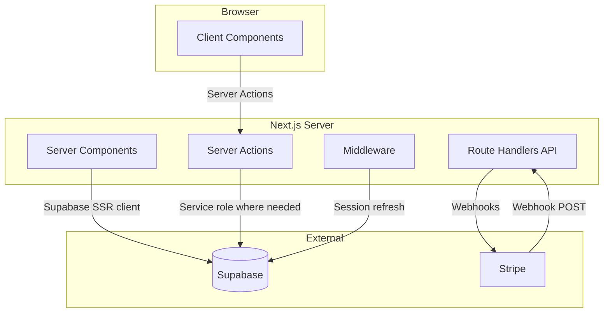
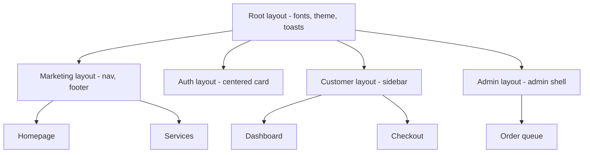
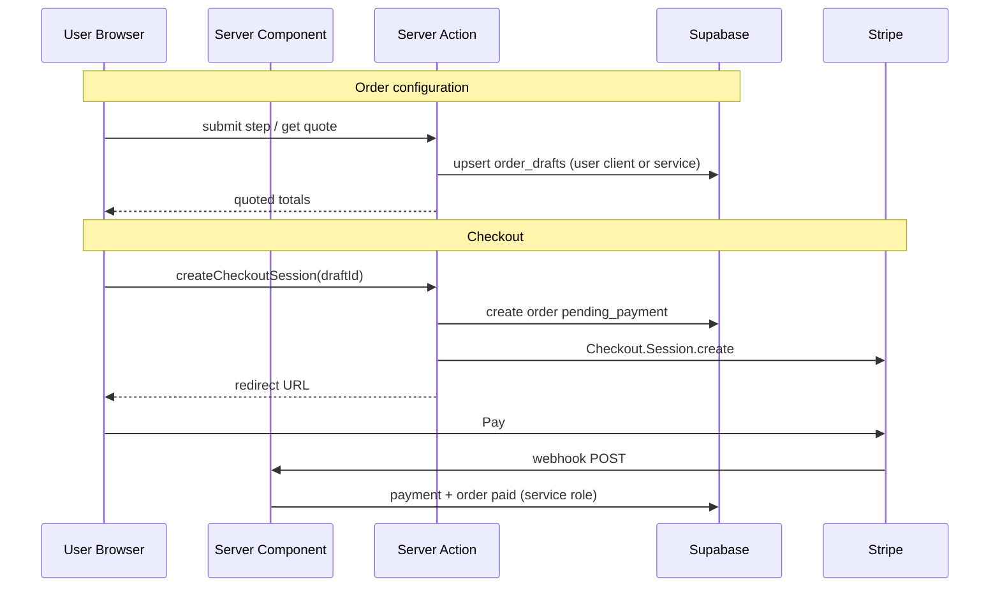

# WGG Apex — Next.js Project Structure

**Version:** 1.0  
**Status:** Architecture blueprint only — no implementation  
**Stack:** Next.js App Router · TypeScript · Tailwind CSS · shadcn/ui · Supabase · Stripe  
**Aligned with:** `PROJECT_SPECIFICATION.md`, `DATABASE_SCHEMA.md`, `UI_UX_PLAN.md`

---

## 1. Overview

This document defines a **production-ready** repository layout for WGG Apex. It separates concerns by **route groups**, **server-only boundaries**, and **domain modules** so marketing, customer app, admin, and webhooks can evolve independently without coupling.

### 1.1 Architectural goals

| Goal | Approach |
|------|----------|
| **Security** | Secrets and Stripe/Supabase service role only on server; RLS for client reads |
| **Performance** | RSC-first marketing; client islands only for forms and interactive admin |
| **Type safety** | Generated Supabase types + Zod at system boundaries |
| **Testability** | Pure domain logic in `lib/`; thin route handlers |
| **Scalability** | Feature folders + colocated components; shared primitives in `components/ui` |

### 1.2 Runtime boundaries



---

## 2. Repository root layout

```text
wgg-apex/
├── .github/
│   └── workflows/                 # CI: lint, typecheck, build (future)
├── docs/                          # Product & architecture docs (existing)
├── public/
│   ├── fonts/                     # Self-hosted subset fonts (optional)
│   ├── images/
│   │   ├── marketing/
│   │   └── og/                    # Open Graph assets per route
│   ├── icons/
│   └── favicon.ico
├── src/                           # All application source (recommended)
│   ├── app/                       # App Router routes & layouts
│   ├── components/                # React components (UI + feature)
│   ├── lib/                       # Domain logic, clients, utilities
│   ├── hooks/                     # Client-only React hooks
│   ├── types/                     # App-level types (extends generated)
│   ├── config/                    # Site config, nav, feature flags
│   └── styles/                    # Global CSS, Tailwind entry
├── supabase/
│   ├── migrations/                # SQL migrations (when implemented)
│   ├── seed.sql                   # Services, tiers seed
│   └── config.toml                # Supabase CLI config
├── .env.example                   # Documented env template
├── .env.local                     # Local secrets (gitignored)
├── components.json                # shadcn/ui config
├── eslint.config.mjs
├── next.config.ts
├── postcss.config.mjs
├── tailwind.config.ts
├── tsconfig.json
├── package.json
└── README.md
```

**Convention:** Use `src/` directory so imports stay stable (`@/` → `src/`).

---

## 3. App Router — route structure

### 3.1 Route groups map

Route groups `(marketing)`, `(auth)`, `(customer)`, `(admin)` **do not affect URLs** — they isolate layouts and auth requirements.

```text
src/app/
├── layout.tsx                     # Root: html, fonts, providers, global metadata
├── globals.css                      # Tailwind + CSS variables (design tokens)
├── not-found.tsx
├── error.tsx
├── global-error.tsx
│
├── (marketing)/                   # Public marketing — no auth required
│   ├── layout.tsx                 # Marketing nav + footer
│   ├── page.tsx                   # Homepage /
│   ├── services/
│   │   ├── page.tsx               # /services
│   │   └── [slug]/
│   │       └── page.tsx           # /services/[slug]
│   ├── how-it-works/
│   │   └── page.tsx               # /how-it-works
│   ├── faq/
│   │   └── page.tsx               # /faq
│   ├── about/
│   │   └── page.tsx               # /about
│   ├── contact/
│   │   └── page.tsx               # /contact
│   └── legal/
│       ├── terms/page.tsx
│       ├── privacy/page.tsx
│       └── refund-policy/page.tsx
│
├── (auth)/                        # Auth pages — minimal chrome
│   ├── layout.tsx
│   └── login/
│       └── page.tsx               # /login
│
├── (customer)/                    # Customer portal — auth required
│   └── app/
│       ├── layout.tsx             # Sidebar / mobile nav shell
│       ├── page.tsx               # /app — dashboard
│       ├── orders/
│       │   ├── page.tsx           # /app/orders — list
│       │   ├── new/
│       │   │   └── page.tsx       # /app/orders/new — redirect helper
│       │   └── [id]/
│       │       └── page.tsx       # /app/orders/[id] — tracking
│       ├── account/
│       │   └── page.tsx           # /app/account
│       └── checkout/
│           ├── [draftId]/
│           │   └── page.tsx       # /app/checkout/[draftId]
│           ├── success/
│           │   └── page.tsx       # /app/checkout/success
│           └── cancel/
│               └── page.tsx       # /app/checkout/cancel
│
├── (admin)/                       # Admin — auth + role guard
│   └── admin/
│       ├── layout.tsx             # Admin sidebar + top bar
│       ├── page.tsx               # /admin — overview KPIs
│       ├── orders/
│       │   ├── page.tsx           # /admin/orders — queue
│       │   └── [id]/
│       │       └── page.tsx       # /admin/orders/[id]
│       ├── customers/
│       │   ├── page.tsx           # /admin/customers
│       │   └── [id]/
│       │       └── page.tsx
│       ├── services/
│       │   └── page.tsx           # /admin/services
│       ├── payments/
│       │   └── page.tsx           # /admin/payments
│       └── settings/
│           └── page.tsx           # /admin/settings
│
├── order/                         # Public order configure (pre-auth friendly)
│   └── [slug]/
│       └── page.tsx               # /order/[slug] — multi-step form
│
├── track/                         # Public tracking (token-based)
│   └── [token]/
│       └── page.tsx               # /track/[token]
│
├── api/                           # Route handlers (webhooks, external callbacks)
│   ├── auth/
│   │   └── callback/
│   │       └── route.ts           # Supabase OAuth callback (if not middleware-only)
│   ├── webhooks/
│   │   └── stripe/
│   │       └── route.ts           # POST Stripe events
│   └── health/
│       └── route.ts               # GET liveness
│
├── sitemap.ts                     # Dynamic sitemap
└── robots.ts
```

### 3.2 URL → responsibility matrix

| URL | Route file | Auth | Render strategy |
|-----|------------|------|-----------------|
| `/` | `(marketing)/page.tsx` | None | SSG / ISR |
| `/services` | `(marketing)/services/page.tsx` | None | SSG / ISR |
| `/services/[slug]` | `(marketing)/services/[slug]/page.tsx` | None | SSG + dynamic params |
| `/order/[slug]` | `order/[slug]/page.tsx` | Optional | SSR + client form island |
| `/login` | `(auth)/login/page.tsx` | Redirect if session | SSR |
| `/app/*` | `(customer)/app/**` | Customer | SSR + protected layout |
| `/app/checkout/[draftId]` | checkout page | Customer | SSR |
| `/admin/*` | `(admin)/admin/**` | Admin RBAC | SSR + dense client tables |
| `/track/[token]` | `track/[token]/page.tsx` | Token only | SSR |
| `/api/webhooks/stripe` | `api/webhooks/stripe/route.ts` | Stripe signature | Node runtime |

### 3.3 Middleware (`src/middleware.ts`)

Placed at `src/middleware.ts` (or project root per Next.js convention).

**Responsibilities**

1. Refresh Supabase session (`@supabase/ssr`)
2. Redirect unauthenticated users from `/app/*` → `/login?redirectTo=...`
3. Redirect non-admin from `/admin/*` → `/app` or 403 page
4. Optional: rate-limit headers / geo (future)

**Matcher config**

```text
/app/:path*
/admin/:path*
/login
```

Marketing, `/order/*`, `/track/*`, `/api/webhooks/*` excluded from auth redirects (webhook uses signature auth).

### 3.4 Layout hierarchy



---

## 4. Component architecture

### 4.1 Layer model

| Layer | Location | Rules |
|-------|----------|-------|
| **Primitives** | `components/ui/*` | shadcn/ui only; no business logic |
| **Shared** | `components/shared/*` | Cross-feature: logo, price display, status badge |
| **Layout** | `components/layout/*` | Nav, footer, sidebars, page shells |
| **Feature** | `components/{feature}/*` | Domain UI; may use server actions |
| **Page sections** | Colocated or `components/marketing/sections/*` | Homepage blocks |

**Dependency rule:** `ui` → `shared` → `feature` → `app pages`. Features must not import from other features directly — go through `lib/` or `shared/`.

### 4.2 Folder structure — components

```text
src/components/
├── ui/                            # shadcn/ui (button, input, dialog, ...)
│
├── layout/
│   ├── marketing-header.tsx
│   ├── marketing-footer.tsx
│   ├── customer-sidebar.tsx
│   ├── customer-mobile-nav.tsx
│   ├── admin-sidebar.tsx
│   ├── admin-top-bar.tsx
│   └── page-container.tsx
│
├── shared/
│   ├── logo.tsx
│   ├── price-display.tsx          # Cents → formatted currency
│   ├── order-number.tsx           # Monospace order #
│   ├── status-badge.tsx           # order_status → icon + label + color
│   ├── trust-strip.tsx            # Stripe / SSL badges
│   ├── empty-state.tsx
│   ├── loading-skeleton.tsx
│   └── error-boundary-fallback.tsx
│
├── marketing/
│   ├── sections/
│   │   ├── hero-section.tsx
│   │   ├── how-it-works-section.tsx
│   │   ├── featured-services-section.tsx
│   │   ├── testimonials-section.tsx
│   │   ├── faq-section.tsx
│   │   └── cta-band-section.tsx
│   └── service-card.tsx
│
├── services/
│   ├── service-list.tsx
│   ├── service-detail-hero.tsx
│   ├── service-tier-ladder.tsx
│   └── service-pricing-explainer.tsx
│
├── order/
│   ├── order-stepper.tsx
│   ├── order-form-shell.tsx       # Client wrapper for steps
│   ├── steps/
│   │   ├── platform-step.tsx
│   │   ├── details-step.tsx       # Per-service variants via registry
│   │   ├── options-step.tsx
│   │   └── review-step.tsx
│   ├── tier-combobox.tsx
│   ├── order-summary-panel.tsx    # Live quote sidebar
│   └── order-summary-drawer.tsx # Mobile collapsible
│
├── checkout/
│   ├── checkout-review.tsx
│   ├── checkout-payment-card.tsx
│   └── checkout-success.tsx
│
├── tracking/
│   ├── order-status-hero.tsx
│   ├── order-progress-stepper.tsx
│   ├── order-timeline.tsx
│   └── order-details-card.tsx
│
├── dashboard/                     # Customer dashboard widgets
│   ├── active-orders-list.tsx
│   └── order-card.tsx
│
├── admin/
│   ├── kpi-card.tsx
│   ├── orders-table.tsx
│   ├── orders-table-toolbar.tsx
│   ├── order-detail-header.tsx
│   ├── order-config-panel.tsx
│   ├── status-update-form.tsx
│   ├── admin-notes-list.tsx
│   ├── admin-note-form.tsx
│   ├── payment-info-card.tsx
│   └── customers-table.tsx
│
└── auth/
    ├── login-form.tsx
    └── oauth-buttons.tsx
```

### 4.3 Server vs client components

| Default | Use Server Component when |
|---------|---------------------------|
| **Server** | Static marketing, data fetch, layout shells, initial table data |
| **Client** (`'use client'`) | Stepper, combobox, form state, toast triggers, admin interactive filters |

**Pattern:** Page (RSC) fetches data → passes props to Client child for interactivity.

```text
page.tsx (Server)
  └── OrderFormShell (Client)
        └── steps/* (Client)
        └── OrderSummaryPanel (Client) — receives quotedCents from server action
```

### 4.4 shadcn/ui integration

- **Config:** `components.json` at repo root; aliases `@/components/ui`, `@/lib/utils`
- **Add components incrementally:** `button`, `input`, `label`, `select`, `dialog`, `sheet`, `tabs`, `accordion`, `table`, `badge`, `card`, `separator`, `sonner` (toast), `dropdown-menu`, `command` (admin search Phase 1.5)
- **Theming:** CSS variables in `globals.css` mapped to Tailwind (`--background`, `--primary`, etc.) per `UI_UX_PLAN.md`

### 4.5 Component naming conventions

| Pattern | Example |
|---------|---------|
| PascalCase files | `order-summary-panel.tsx` |
| Feature prefix | `admin-orders-table.tsx` |
| No default export in `ui/` | shadcn convention |
| Props interfaces | `OrderSummaryPanelProps` colocated or in `types/` |

---

## 5. Lib & domain modules (`src/lib/`)

Server-only modules use `import 'server-only'` at top where applicable.

```text
src/lib/
├── supabase/
│   ├── client.ts                  # Browser client (anon key)
│   ├── server.ts                  # Server Component client (cookies)
│   ├── middleware.ts              # Middleware session helper
│   └── admin.ts                   # Service role client (webhooks, admin writes)
│
├── stripe/
│   ├── client.ts                  # Stripe SDK instance (server-only)
│   ├── checkout.ts                # Create Checkout Session
│   └── webhooks.ts                # Verify signature, dispatch handlers
│
├── auth/
│   ├── session.ts                 # getSession, getCurrentUser
│   ├── guards.ts                  # requireAuth, requireAdmin, requireRole
│   └── roles.ts                   # Role checks vs profiles.role
│
├── db/                            # Data access layer (queries)
│   ├── profiles.ts
│   ├── services.ts
│   ├── service-tiers.ts
│   ├── order-drafts.ts
│   ├── orders.ts
│   ├── order-items.ts
│   ├── payments.ts
│   ├── status-updates.ts
│   └── admin-notes.ts
│
├── pricing/
│   ├── quote.ts                   # Pure: compute quote from tiers + options
│   ├── validators.ts              # Zod schemas for form payloads
│   └── modifiers.ts               # Duo, express, platform multipliers
│
├── orders/
│   ├── create-from-draft.ts
│   ├── generate-order-number.ts
│   └── status-machine.ts          # Valid transitions, side effects
│
├── email/                         # Phase 1 — transactional
│   ├── client.ts
│   └── templates/
│
├── utils/
│   ├── cn.ts                      # clsx + tailwind-merge (shadcn)
│   ├── currency.ts                # formatCents, parseDisplay
│   └── dates.ts                   # formatRelative, timezones
│
└── constants/
    ├── order-status.ts            # Labels, customer copy map
    ├── platforms.ts
    └── regions.ts
```

### 5.1 Actions directory (Server Actions)

```text
src/actions/
├── auth/
│   └── sign-out.ts
├── order-drafts/
│   ├── save-draft.ts
│   └── get-quote.ts
├── checkout/
│   └── create-checkout-session.ts
├── orders/
│   └── get-customer-orders.ts
└── admin/
    ├── update-order-status.ts
    ├── create-admin-note.ts
    └── list-orders.ts
```

**Convention:** One action per file; Zod-validated input; return `{ data } | { error }` discriminated union.

---

## 6. Data flow architecture

### 6.1 High-level flows



### 6.2 Supabase client selection

| Context | Client | Key | RLS |
|---------|--------|-----|-----|
| Server Component read | `createServerClient` | Anon + cookies | Yes — user context |
| Server Action (customer) | `createServerClient` | Anon + cookies | Yes |
| Stripe webhook / batch job | `createAdminClient` | Service role | Bypass — server only |
| Browser (realtime Phase 2) | `createBrowserClient` | Anon | Yes |

**Rule:** Service role key never in Client Components or `NEXT_PUBLIC_*`.

### 6.3 Data access pattern

```text
Page (RSC)
  → lib/auth/guards.requireAuth()
  → lib/db/orders.getOrderById(id)
  → render with typed data

Client form
  → actions/order-drafts/get-quote.ts
  → lib/pricing/quote.compute()
  → lib/db/order-drafts.upsert()
```

- **No raw Supabase calls in components** — always through `lib/db/*`
- **Generated types:** `src/types/database.ts` from `supabase gen types typescript`

### 6.4 Order & checkout data flow

| Stage | Tables touched | Writer |
|-------|----------------|--------|
| Configure | `order_drafts` | Server Action (user RLS or service) |
| Quote | — (read `services`, `service_tiers`, `service_tier_prices`) | Pure `lib/pricing` |
| Checkout init | `orders`, `order_items`, `payments` (pending) | Server Action + service role if RLS blocks |
| Stripe paid | `payments`, `orders`, `status_updates` | Webhook handler (service role) |
| Admin update | `status_updates`, `orders` | Server Action (admin guard) |
| Customer view | `orders`, `status_updates` (visible only) | RSC read (RLS) |

### 6.5 Stripe webhook flow

```text
POST /api/webhooks/stripe
  1. stripe.webhooks.constructEvent(rawBody, sig, secret)
  2. Idempotency: check payments.stripe_event_id
  3. switch event.type
       checkout.session.completed → mark paid, status_updates, email job
       payment_intent.payment_failed → payments.status failed
       charge.refunded → orders + payments refunded
  4. Return 200 quickly; heavy work async (future: queue)
```

**Runtime:** `export const runtime = 'nodejs'` on webhook route (Stripe SDK).

### 6.6 Caching & revalidation

| Data | Strategy |
|------|----------|
| Services catalog | `unstable_cache` or ISR 3600s on marketing pages |
| User orders | `cache: 'no-store'` or tag `orders-{userId}` |
| Admin queue | `revalidatePath('/admin/orders')` after status mutation |
| Pricing rules | Short TTL cache; invalidate on admin service edit |

### 6.7 Error handling contract

| Layer | Pattern |
|-------|---------|
| Server Action | Return `{ error: { code, message } }` — no throw to client for expected errors |
| Route Handler | Webhook: log + 400 on bad sig; 200 on duplicate event |
| RSC | `notFound()` for missing order; redirect for auth |
| Client | Toast via Sonner on action error |

---

## 7. Types, config, hooks

### 7.1 Types (`src/types/`)

```text
src/types/
├── database.ts                    # Generated Supabase Database type
├── index.ts                       # Re-exports
├── order.ts                       # Enriched OrderWithItems, OrderSummary
├── pricing.ts                     # QuoteResult, QuoteLineItem
└── api.ts                         # Action return types, ApiError
```

### 7.2 Config (`src/config/`)

```text
src/config/
├── site.ts                        # name, url, supportEmail
├── navigation.ts                  # Marketing + app nav items
├── services.ts                    # Static fallbacks / feature flags
└── stripe.ts                      # Price display, allowed countries (future)
```

### 7.3 Hooks (`src/hooks/`)

Client-only hooks — keep thin:

```text
src/hooks/
├── use-order-draft.ts             # Draft state + sync to server action
├── use-media-query.ts
└── use-debounce.ts                # Quote debounce on tier change
```

---

## 8. Styles & design tokens

```text
src/styles/
└── globals.css                    # @tailwind base/components/utilities + CSS vars

tailwind.config.ts                 # Extend colors from UI_UX_PLAN tokens
```

**Tokens in CSS variables:** `--bg-base`, `--surface-1`, `--accent`, `--text-secondary`, etc., mapped in `tailwind.config.ts` for `bg-surface-1`, `text-secondary`.

---

## 9. Supabase project layout

```text
supabase/
├── config.toml
├── migrations/
│   └── YYYYMMDDHHMMSS_initial_schema.sql   # When implemented
└── seed.sql                                 # services + service_tiers
```

**Local dev:** `supabase start` + `supabase db reset` for seed.

---

## 10. Environment variables

Document in `.env.example` only (no secrets in repo).

| Variable | Exposure | Purpose |
|----------|----------|---------|
| `NEXT_PUBLIC_SITE_URL` | Public | Canonical URL, Stripe redirects |
| `NEXT_PUBLIC_SUPABASE_URL` | Public | Supabase project |
| `NEXT_PUBLIC_SUPABASE_ANON_KEY` | Public | Browser + RLS client |
| `SUPABASE_SERVICE_ROLE_KEY` | Server | Webhooks, privileged writes |
| `STRIPE_SECRET_KEY` | Server | Checkout + refunds |
| `STRIPE_WEBHOOK_SECRET` | Server | Webhook verification |
| `NEXT_PUBLIC_STRIPE_PUBLISHABLE_KEY` | Public | Optional Elements (Checkout redirect MVP may skip) |
| `RESEND_API_KEY` | Server | Email (Phase 1) |

---

## 11. Import aliases (`tsconfig.json`)

```json
{
  "paths": {
    "@/*": ["./src/*"],
    "@/components/*": ["./src/components/*"],
    "@/lib/*": ["./src/lib/*"],
    "@/actions/*": ["./src/actions/*"],
    "@/types/*": ["./src/types/*"],
    "@/config/*": ["./src/config/*"]
  }
}
```

---

## 12. Security checklist (structure-level)

- [ ] `server-only` on `lib/supabase/admin.ts`, `lib/stripe/*`
- [ ] Middleware session refresh before RSC render
- [ ] Admin layout calls `requireAdmin()` in addition to middleware
- [ ] Webhook route excluded from auth middleware; signature verified
- [ ] No service role in Client Components or Server Actions callable from unauthenticated contexts without validation
- [ ] Zod validate all Server Action inputs
- [ ] CSP headers in `next.config.ts` (Stripe domains allowlisted)

---

## 13. Testing structure (future)

```text
src/
├── __tests__/
│   ├── unit/
│   │   └── pricing/quote.test.ts
│   └── integration/
│       └── webhooks/stripe.test.ts
e2e/
└── playwright/                    # Critical paths: order → checkout
```

**MVP:** Prioritize unit tests on `lib/pricing` and `lib/orders/status-machine`.

---

## 14. Implementation order (when starting)

1. Scaffold Next.js + Tailwind + shadcn + path aliases  
2. `globals.css` design tokens + root layout  
3. Supabase clients + middleware + auth layout  
4. Marketing shell (layout, homepage placeholder)  
5. `lib/db` + `lib/pricing` + order form actions  
6. Checkout + Stripe webhook  
7. Customer `/app` routes + tracking  
8. Admin routes + RBAC guards  

---

## 15. Document cross-reference

| Topic | Document |
|-------|----------|
| Business routes & flows | `PROJECT_SPECIFICATION.md` |
| Tables & RLS | `DATABASE_SCHEMA.md` |
| Visual design per page | `UI_UX_PLAN.md` |
| This file | Folder, route, component, data flow |

---

*End of project structure blueprint. No application code generated per directive.*
