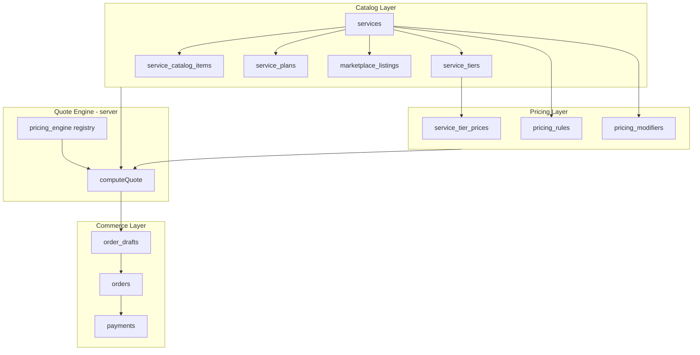
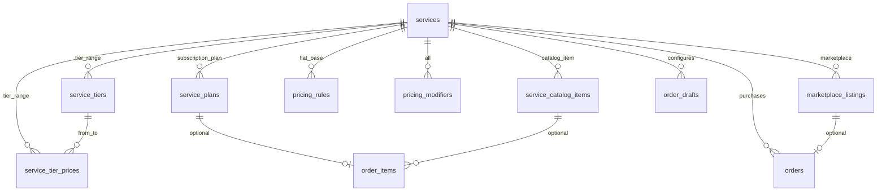
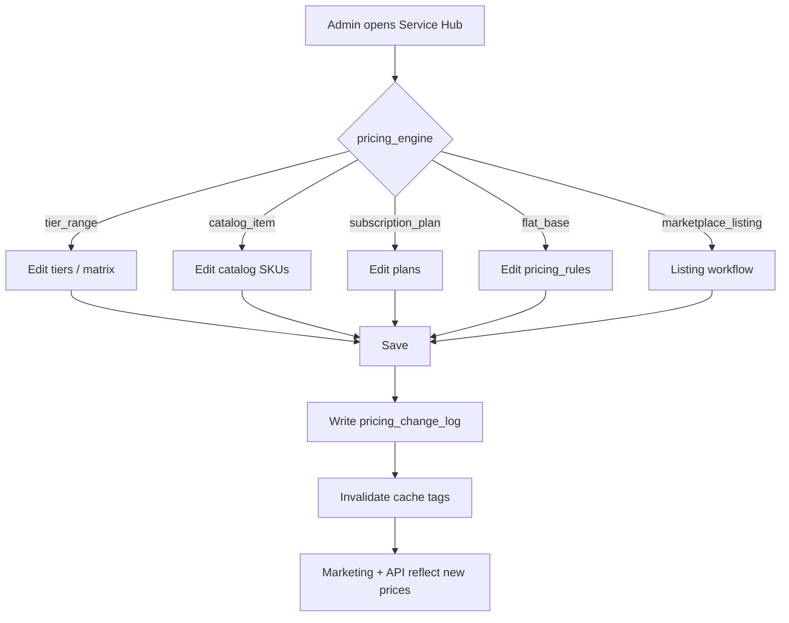
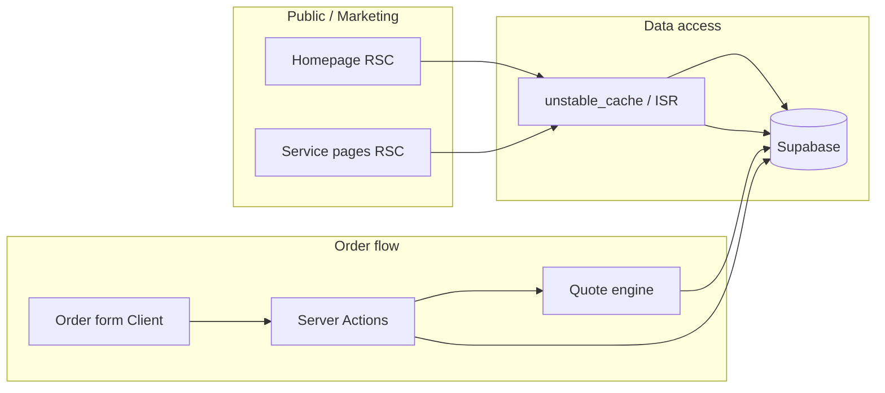

# WGG Apex — Scalable Services Architecture

**Version:** 1.0  
**Status:** Architecture specification only — no implementation  
**Last updated:** 2026-06-04  
**Aligned with:** `DATABASE_SCHEMA.md`, `PROJECT_STRUCTURE.md`, `PROJECT_SPECIFICATION.md`

---

## 1. Current platform analysis

### 1.1 What exists today (implemented)

| Layer | State | Issue |
|-------|--------|-------|
| **Marketing UI** | Production homepage with 10 sections | All service copy, prices, badges, plans, and accounts are **hardcoded** in `src/config/platform.ts` |
| **Database** | Not connected | `docs/DATABASE_SCHEMA.md` defines `services`, `service_tiers`, `service_tier_prices` but no Supabase migrations or queries |
| **Admin** | Not built | No `/admin/services` implementation |
| **Order flow** | Links only (`/order/*`, `/marketplace/*`) | Routes 404; no dynamic order forms |
| **Pricing engine** | None | Prices rendered as static JSX (`$49`, `$199`, etc.) |

### 1.2 Hardcoded inventory (must migrate to DB)

| Data today | Location | Target |
|------------|----------|--------|
| 5 platform services | `platformServices[]` | `services` |
| Rank tier table | `rankPricingTiers[]` | `service_tiers` + `service_tier_prices` or tier `unit_price_cents` |
| Predator plans | `predatorMaintenancePlans[]` | `service_plans` |
| Badge catalog | `badgeServices[]` | `service_catalog_items` |
| Unban starting price | inline `$149` | `pricing_rules` / `service_plans` |
| Featured accounts | `featuredAccounts[]` | `marketplace_listings` |
| FAQ (service-related) | `faqItems[]` | `content_blocks` or `faq_entries` (optional CMS) |

### 1.3 Architectural gap

The UI treats **five different product lines** as one marketing page, but they are **five pricing models**:

| Service | Pricing nature | Current hack |
|---------|----------------|--------------|
| Ranked Boosting | Range / matrix (from → to) | Static table |
| Badge Boosting | Catalog (SKU list) | Static grid |
| Predator Maintenance | Subscription plans | Static cards |
| Unban Service | Flat + optional modifiers | Static copy |
| Account Marketplace | Per-listing inventory | Static cards |

A scalable design must unify **catalog + rules + quote engine** while allowing each service type to keep its own semantics.

### 1.4 Design goals (from requirements)

1. **Database-driven** — Single source of truth in Supabase PostgreSQL  
2. **Admin-editable pricing** — No deploy to change prices  
3. **No hardcoded prices in frontend** — Display and checkout read from API/DB  
4. **Add services without code changes** — New rows + JSON config, using **generic pricing engines** already in the app  

**Constraint (honest):** Adding a wholly new *pricing model* (e.g. auction-based bids) still requires a new engine in code once. Adding a new service that uses an **existing engine** requires **zero application deploy** for catalog/pricing data.

---

## 2. Conceptual model



**Principles**

- **`services`** = product definition (what it is, how to sell it, which engine to use)  
- **Child tables** = priceable SKUs (tiers, badges, plans, listings)  
- **`pricing_rules` + `pricing_modifiers`** = cross-cutting math (express, duo, platform)  
- **Quote engine** = pure server logic keyed by `services.pricing_engine` — numbers only from DB  
- **Orders** = immutable snapshot at purchase time (never retroactive price changes)

---

## 3. Database structure

### 3.1 Enum extensions

```sql
-- Replaces narrow service_pricing_model with engine key used by app registry
CREATE TYPE public.pricing_engine AS ENUM (
  'tier_range',           -- Ranked boosting: from_tier → to_tier
  'catalog_item',         -- Badge boosting: one or more catalog SKUs
  'subscription_plan',    -- Predator maintenance: weekly/monthly plans
  'flat_base',            -- Unban: base fee + modifiers
  'marketplace_listing'   -- Account marketplace: price on listing row
);

CREATE TYPE public.service_category AS ENUM (
  'boosting',
  'maintenance',
  'achievement',
  'recovery',
  'marketplace'
);

CREATE TYPE public.catalog_item_type AS ENUM (
  'badge',
  'achievement',
  'package'
);

CREATE TYPE public.plan_interval AS ENUM (
  'week',
  'month',
  'one_time'
);

CREATE TYPE public.listing_status AS ENUM (
  'draft',
  'published',
  'reserved',
  'sold',
  'archived'
);

CREATE TYPE public.modifier_type AS ENUM (
  'percent',
  'fixed_cents'
);

CREATE TYPE public.modifier_apply_to AS ENUM (
  'subtotal',
  'per_unit'
);
```

### 3.2 Core table: `services` (evolved)

| Column | Type | Notes |
|--------|------|-------|
| `id` | `uuid` PK | |
| `slug` | `text` UNIQUE | URL: `/services/[slug]`, `/order/[slug]` |
| `name` | `text` | Admin + marketing |
| `short_description` | `text` | Cards |
| `description` | `text` | Detail page |
| `category` | `service_category` | Grouping, filters |
| `pricing_engine` | `pricing_engine` | Drives quote calculator |
| `is_active` | `boolean` | Public visibility |
| `sort_order` | `int` | Global catalog order |
| `form_schema` | `jsonb` | JSON Schema / custom field defs for order UI |
| `pricing_config` | `jsonb` | Engine-specific defaults (min/max, allowed platforms) |
| `display_config` | `jsonb` | Homepage section, icon key, ETA template, anchor id |
| `metadata` | `jsonb` | SEO, feature flags |
| `created_at`, `updated_at` | `timestamptz` | |

**`display_config` example (no prices):**

```json
{
  "homepage_section": "services_overview",
  "icon": "trophy",
  "href_anchor": "rank-pricing",
  "show_from_price": true,
  "eta_label": "3–7 days"
}
```

**Seed mapping (initial five services):**

| slug | category | pricing_engine |
|------|----------|----------------|
| `ranked-boosting` | boosting | `tier_range` |
| `badge-boosting` | achievement | `catalog_item` |
| `predator-maintenance` | maintenance | `subscription_plan` |
| `apex-unban` | recovery | `flat_base` |
| `account-marketplace` | marketplace | `marketplace_listing` |

---

### 3.3 Ranked boosting — tiers & matrix

#### `service_tiers` (unchanged concept, required columns)

Used by `tier_range` engine. Full rank ladder (Bronze IV … Predator).

| Column | Notes |
|--------|-------|
| `service_id` | FK → `ranked-boosting` |
| `code`, `name`, `tier_group`, `division`, `sort_order` | |
| `unit_price_cents` | Optional: per-division step price (sum path) |
| `metadata` | `eta_days_min`, `eta_days_max` per group |

#### `service_tier_prices` (matrix path)

| Column | Notes |
|--------|-------|
| `service_id` | Denormalized for admin UI |
| `from_tier_id`, `to_tier_id` | |
| `price_cents` | Fixed quote for pair |
| `currency` | Default `USD` |
| `valid_from`, `valid_to` | Scheduled price changes |

**Quote logic:** Prefer matrix cell; fallback sum adjacent `unit_price_cents` along `sort_order` path.

---

### 3.4 Badge boosting — catalog items

#### `service_catalog_items`

| Column | Type | Notes |
|--------|------|-------|
| `id` | `uuid` PK | |
| `service_id` | FK | `badge-boosting` |
| `sku` | `text` UNIQUE per service | `badge_4000_damage` |
| `name` | `text` | Display name |
| `description` | `text` nullable | |
| `item_type` | `catalog_item_type` | |
| `price_cents` | `bigint` | **Admin-editable** |
| `difficulty` | `text` nullable | `Standard` / `Advanced` / `Elite` (display only) |
| `sort_order` | `int` | |
| `is_active` | `boolean` | |
| `metadata` | `jsonb` | |
| `created_at`, `updated_at` | `timestamptz` | |

**Quote logic:** `SUM(selected catalog_item.price_cents)` for multi-badge orders.

---

### 3.5 Predator maintenance — subscription plans

#### `service_plans`

| Column | Type | Notes |
|--------|------|-------|
| `id` | `uuid` PK | |
| `service_id` | FK | `predator-maintenance` |
| `code` | `text` | `core`, `pro`, `elite` |
| `name` | `text` | |
| `price_cents` | `bigint` | **Per interval** |
| `interval` | `plan_interval` | `week` |
| `features` | `jsonb` | string[] for UI bullets |
| `is_featured` | `boolean` | |
| `sort_order` | `int` | |
| `is_active` | `boolean` | |
| `stripe_price_id` | `text` nullable | Phase 2 subscriptions |
| `metadata` | `jsonb` | |
| `created_at`, `updated_at` | `timestamptz` | |

**Quote logic:** `plan.price_cents` × billing quantity (default 1 week).

---

### 3.6 Unban service — flat base + modifiers

#### `pricing_rules` (service-scoped)

| Column | Type | Notes |
|--------|------|-------|
| `id` | `uuid` PK | |
| `service_id` | FK | |
| `rule_key` | `text` | `base_fee`, `screening_fee` |
| `price_cents` | `bigint` | |
| `currency` | `char(3)` | |
| `config` | `jsonb` | Extra conditions |
| `valid_from`, `valid_to` | `timestamptz` nullable | |
| `is_active` | `boolean` | |

**Quote logic (`flat_base`):** `base_fee` + selected options from `form_schema` (e.g. expedited review modifier).

Unban does **not** use `service_tiers`; eligibility may set quote to `0` and block checkout (operator-only).

---

### 3.7 Account marketplace — listings (inventory)

Marketplace is **inventory-driven**, not a single catalog price.

#### `marketplace_listings`

| Column | Type | Notes |
|--------|------|-------|
| `id` | `uuid` PK | |
| `service_id` | FK | `account-marketplace` |
| `listing_number` | `text` UNIQUE | `ACC-2026-00012` |
| `title` | `text` | |
| `description` | `text` nullable | Internal + public safe |
| `rank_label` | `text` | `Master` |
| `rp_label` | `text` | `18,400 RP` |
| `platform` | `platform_type` | |
| `price_cents` | `bigint` | **Per listing** |
| `currency` | `char(3)` | |
| `status` | `listing_status` | |
| `is_featured` | `boolean` | Homepage featured strip |
| `tags` | `text[]` | `Heirloom`, `Clean history` |
| `verified_at` | `timestamptz` nullable | |
| `verified_by` | `uuid` FK → `profiles` nullable | |
| `metadata` | `jsonb` | Non-sensitive game stats |
| `created_at`, `updated_at` | `timestamptz` | |
| `published_at`, `sold_at` | `timestamptz` nullable | |

**Quote logic (`marketplace_listing`):** `listing.price_cents` at time of reservation; lock row on checkout init.

**Homepage “from price”:** `MIN(price_cents) WHERE status = published` (or hide if null).

---

### 3.8 Cross-cutting: `pricing_modifiers`

Applies across engines where relevant (ranked, badges, unban).

| Column | Type | Notes |
|--------|------|-------|
| `id` | `uuid` PK | |
| `service_id` | FK nullable | null = global |
| `code` | `text` | `duo`, `express`, `platform_pc` |
| `name` | `text` | |
| `modifier_type` | `modifier_type` | |
| `value` | `bigint` | percent (0–100) or cents |
| `apply_to` | `modifier_apply_to` | |
| `is_active` | `boolean` | |
| `sort_order` | `int` | |
| `metadata` | `jsonb` | |

**Quote logic:** Apply after subtotal in deterministic `sort_order`; store breakdown on draft.

---

### 3.9 Derived views (read performance)

#### `service_public_catalog_v`

Exposes safe columns for marketing + ISR:

- `service_id`, `slug`, `name`, descriptions, `category`, `pricing_engine`, `display_config`, `sort_order`
- `from_price_cents` — computed per engine (see §3.10)
- `from_price_label` — e.g. `/ week`, `Listings vary`

#### `service_from_prices_v` (computation rules)

| pricing_engine | `from_price_cents` source |
|----------------|---------------------------|
| `tier_range` | `MIN(matrix.price_cents)` or `MIN(tier.unit_price_cents)` |
| `catalog_item` | `MIN(catalog_item.price_cents WHERE active)` |
| `subscription_plan` | `MIN(plan.price_cents WHERE active)` |
| `flat_base` | `MIN(pricing_rules.price_cents WHERE rule_key = 'base_fee')` |
| `marketplace_listing` | `MIN(listing.price_cents WHERE published)` or NULL |

---

### 3.10 Commerce tables (unchanged role)

| Table | Link to services |
|-------|------------------|
| `order_drafts` | `service_id`, `form_payload`, `quoted_*_cents`, optional `catalog_item_ids[]`, `plan_id`, `listing_id` |
| `orders` | Same + `order_items.configuration` snapshot |
| `order_items` | `service_id`, `configuration` jsonb, line cents |
| `payments` | Stripe linkage |

**Snapshot rule:** On payment, copy all display names and `price_cents` into `order_items.configuration` so admin edits never alter past orders.

---

### 3.11 Admin audit & history

#### `pricing_change_log`

| Column | Notes |
|--------|-------|
| `entity_type` | `service`, `tier`, `catalog_item`, `plan`, `listing`, `modifier` |
| `entity_id` | `uuid` |
| `changed_by` | `profiles.id` |
| `before`, `after` | `jsonb` |
| `created_at` | |

Enables rollback visibility and support disputes.

---

### 3.12 Entity relationship (full)



---

## 4. Pricing engine registry (server-only)

Implemented once in `lib/pricing/engines/*`. **No prices in code** — only algorithms.

| Engine key | Input (from `form_payload`) | Output |
|------------|----------------------------|--------|
| `tier_range` | `from_tier_id`, `to_tier_id`, modifiers | `subtotal_cents`, line items |
| `catalog_item` | `catalog_item_ids[]`, modifiers | sum of SKU prices |
| `subscription_plan` | `plan_id`, `quantity` | `plan.price × quantity` |
| `flat_base` | options + `pricing_rules` | base + option fees |
| `marketplace_listing` | `listing_id` | `listing.price_cents` |

**Adding a new service without deploy:**

1. Admin creates `services` row with existing `pricing_engine`  
2. Admin populates child SKUs (tiers, items, plans, or listings)  
3. Admin sets `form_schema` + `display_config`  
4. Frontend generic renderer loads schema + catalog via API  

**Requires deploy:** New `pricing_engine` enum value + new engine module.

---

## 5. `form_schema` contract (dynamic order UI)

Stored on `services.form_schema` — JSON Schema 2020-12 or internal format:

```json
{
  "version": 1,
  "steps": [
    {
      "id": "platform",
      "title": "Platform",
      "fields": [
        {
          "key": "platform",
          "type": "enum",
          "options": ["pc", "playstation", "xbox"],
          "required": true
        }
      ]
    },
    {
      "id": "details",
      "title": "Rank selection",
      "fields": [
        { "key": "from_tier_id", "type": "tier_select", "label": "Current rank" },
        { "key": "to_tier_id", "type": "tier_select", "label": "Target rank" }
      ]
    }
  ]
}
```

**Field types (generic renderer):**

| type | Data source |
|------|-------------|
| `tier_select` | `service_tiers` |
| `catalog_multi_select` | `service_catalog_items` |
| `plan_select` | `service_plans` |
| `listing_select` | `marketplace_listings` (marketplace checkout) |
| `enum`, `text`, `textarea`, `checkbox` | Static config |

Icons in marketing come from `display_config.icon` string → icon map in code (display only, not pricing).

---

## 6. Admin management flow

### 6.1 Roles

| Role | Capabilities |
|------|----------------|
| `admin` | CRUD catalog, edit prices, publish listings, view logs |
| `super_admin` | + create/disable services, change `pricing_engine`, delete |

### 6.2 Admin routes (planned)

```text
/admin/services                      # List all services
/admin/services/new                  # Create service (super_admin)
/admin/services/[id]                 # Service hub (tabs)
/admin/services/[id]/general         # Copy, slug, engine, active, form_schema
/admin/services/[id]/pricing         # Engine-specific editor (see below)
/admin/services/[id]/modifiers       # pricing_modifiers
/admin/services/[id]/display         # display_config, homepage flags
/admin/marketplace/listings          # All listings (shortcut)
/admin/marketplace/listings/[id]     # Listing editor
/admin/pricing/history               # pricing_change_log
```

### 6.3 Engine-specific pricing editors

| Service | Admin UI | Actions |
|---------|----------|---------|
| **Ranked Boosting** | Tier ladder table + matrix spreadsheet | Add tier, reorder, edit `unit_price_cents`, edit matrix cells, bulk % increase |
| **Badge Boosting** | Catalog table | Add SKU, set `price_cents`, difficulty label, toggle active |
| **Predator Maintenance** | Plan cards editor | Edit plan price, features JSON, featured flag |
| **Unban Service** | Base fee + option fees | Edit `pricing_rules`, copy for eligibility |
| **Account Marketplace** | Listings queue | Create listing, set price, verify, publish, feature on homepage |

### 6.4 Typical admin workflows



**Listing workflow (marketplace):**

1. Draft → operator fills rank, RP, platform, internal notes  
2. Set `price_cents`  
3. Verify → `verified_at`, `verified_by`  
4. Publish → `status = published`, optional `is_featured`  
5. Customer reserves → `reserved` during checkout  
6. Paid → `sold`  

### 6.5 Validation guards (admin)

- Prevent `price_cents < 0`  
- Prevent deactivating service with open `paid` orders  
- Matrix: `from.sort_order < to.sort_order`  
- Slug immutable after first order (or versioned redirects)  
- Warn on >20% price drop without confirmation (optional business rule)

### 6.6 Cache invalidation

| Tag | When revalidated |
|-----|------------------|
| `services-catalog` | Any service/catalog change |
| `service:{slug}` | Single service update |
| `homepage-pricing` | Tier matrix, plans, featured listings |
| `marketplace-listings` | Listing publish/sold |

Use `revalidateTag()` from Server Actions after admin saves.

---

## 7. Frontend data flow

### 7.1 Layer overview



**Rule:** Components never import `platform.ts` prices. `platform.ts` deleted or limited to non-price content (e.g. `whyWggItems` until CMS exists).

---

### 7.2 Homepage sections → data sources

| Section | Data query | Notes |
|---------|------------|-------|
| Hero | Static copy + optional `service_public_catalog_v` count | No prices required |
| Why WGG | CMS / static until `content_blocks` | No prices |
| Services overview | `SELECT * FROM service_public_catalog_v WHERE is_active` | `from_price_cents` from view |
| Rank boosting pricing | Tiers + matrix for `slug = ranked-boosting` | Full table from DB |
| Badge services | `service_catalog_items` active | Grid from DB |
| Unban service | `pricing_rules` base_fee + service copy | Display from fee rule |
| Featured accounts | `marketplace_listings` featured + published | No hardcoded cards |
| Customer process | Static | — |
| FAQ | `faq_entries` or static | — |
| CTA | Static | — |

**Rendering strategy:**

- Fetch in Server Components via `lib/db/services.getPublicCatalog()`  
- ISR `revalidate: 300` (5 min) or on-demand via admin revalidation  
- Skeleton states while loading (client islands only for interactive bits)

---

### 7.3 Service detail & order pages

| Route | Flow |
|-------|------|
| `/services/[slug]` | RSC: `getServiceBySlug(slug)` + engine-specific catalog (tiers, items, plans) |
| `/order/[slug]` | RSC: service + `form_schema` + catalog payloads as props → `OrderFormShell` (client) |

**Order form client flow:**

1. User fills step → local state keyed by `form_schema`  
2. On change → debounced `getQuote` Server Action  
3. Action loads service + children from DB, runs `pricing_engine`  
4. Returns `{ subtotal, modifiers, total, lineItems, valid, errors }`  
5. Summary panel renders returned numbers (format with `formatCents`)  
6. Submit → `createDraft` → checkout session  

---

### 7.4 API / Server Action surface (planned)

| Function | Type | Purpose |
|----------|------|---------|
| `getPublicCatalog()` | RSC / cache | Homepage + nav |
| `getServiceBySlug(slug)` | RSC | Detail + order |
| `getRankPricingTable(serviceId)` | RSC | Homepage rank section |
| `getCatalogItems(serviceId)` | RSC | Badge grid |
| `getPlans(serviceId)` | RSC | Predator cards |
| `getFeaturedListings(limit)` | RSC | Homepage accounts |
| `getQuote(serviceId, payload)` | Server Action | Live pricing |
| `saveDraft(...)` | Server Action | Persist draft |
| `admin.updateCatalogItem(...)` | Server Action | Admin only + audit log |

---

### 7.5 TypeScript types (generated + enriched)

```text
src/types/
  database.ts          # supabase gen types
  service-public.ts    # ServicePublicCatalog, CatalogItemPublic, etc.
  quote.ts             # QuoteResult, QuoteLineItem
```

**`ServicePublicCatalog` (example):**

```typescript
type ServicePublicCatalog = {
  id: string;
  slug: string;
  name: string;
  shortDescription: string | null;
  category: ServiceCategory;
  pricingEngine: PricingEngine;
  fromPriceCents: number | null;
  fromPriceLabel: string | null;
  displayConfig: DisplayConfig;
  sortOrder: number;
};
```

---

### 7.6 Migration path from current codebase

| Step | Action |
|------|--------|
| 1 | Apply Supabase migrations (tables §3) + seed five services |
| 2 | Import current `platform.ts` numbers into seed SQL (one-time) |
| 3 | Implement `lib/db/services/*` + views |
| 4 | Implement pricing engines reading DB only |
| 5 | Refactor marketing sections to RSC + DB props |
| 6 | Remove price fields from `platform.ts`; delete rank/badge/plan arrays |
| 7 | Build admin pricing editors per engine |
| 8 | Wire order form to `form_schema` + `getQuote` |

---

## 8. Adding a sixth service (example, no code change)

**Example:** “Coaching Session” — 1-hour flat SKUs, same as badges.

1. Admin → New service: `coaching`, `pricing_engine = catalog_item`  
2. Add catalog items: `1h_session` $75, `2h_bundle` $140  
3. Set `form_schema` with `catalog_multi_select` + platform enum  
4. Set `display_config.homepage_section = services_overview`  
5. Revalidate cache → appears on site with correct from-price  

**No deploy** if `catalog_item` engine and generic form renderer already exist.

---

## 9. Security & RLS (summary)

| Table | Public read | Admin write |
|-------|-------------|-------------|
| `services` (active) | `is_active = true`, no internal fields | `is_admin()` |
| `service_tiers`, `catalog_items`, `plans` | Active rows only | Admin |
| `service_tier_prices` | Active valid rows | Admin |
| `pricing_rules`, `modifiers` | Active only | Admin |
| `marketplace_listings` | `status = published` (safe columns view) | Admin |
| `pricing_change_log` | Deny | Admin read |

Quotes and drafts: authenticated user or service role; never trust client-submitted `total_cents`.

---

## 10. Open decisions

| # | Question | Recommendation |
|---|----------|----------------|
| 1 | Matrix vs step-sum for rank? | Support both; admin chooses per service in `pricing_config` |
| 2 | Marketplace escrow | Phase 2; MVP: single listing checkout like flat purchase |
| 3 | Multi-currency | Schema ready (`currency` column); MVP: USD only |
| 4 | Homepage section order | `display_config.homepage_section` + `section_sort` table vs hardcoded section map in one config row |
| 5 | FAQ/CMS | Separate `faq_entries` table vs keep static marketing copy |

---

## 11. Deliverables checklist (implementation phase)

- [ ] SQL migrations + seeds for 5 services and child data  
- [ ] `service_public_catalog_v` + `service_from_prices_v`  
- [ ] Pricing engines (5 modules) + `getQuote`  
- [ ] Refactor homepage/marketing to DB-driven prices  
- [ ] Admin service hub + per-engine pricing UI  
- [ ] `pricing_change_log` + revalidation hooks  
- [ ] Delete hardcoded prices from `src/config/platform.ts`  

---

## 12. Document cross-reference

| Topic | Document |
|-------|----------|
| Base tables & RLS | `DATABASE_SCHEMA.md` (merge/ supersede pricing sections with this doc) |
| Routes & `lib/` layout | `PROJECT_STRUCTURE.md` |
| UI sections | `UI_UX_PLAN.md` |
| This architecture | `SERVICES_ARCHITECTURE.md` |

---

*End of services architecture specification. No code or migrations implemented per directive.*
